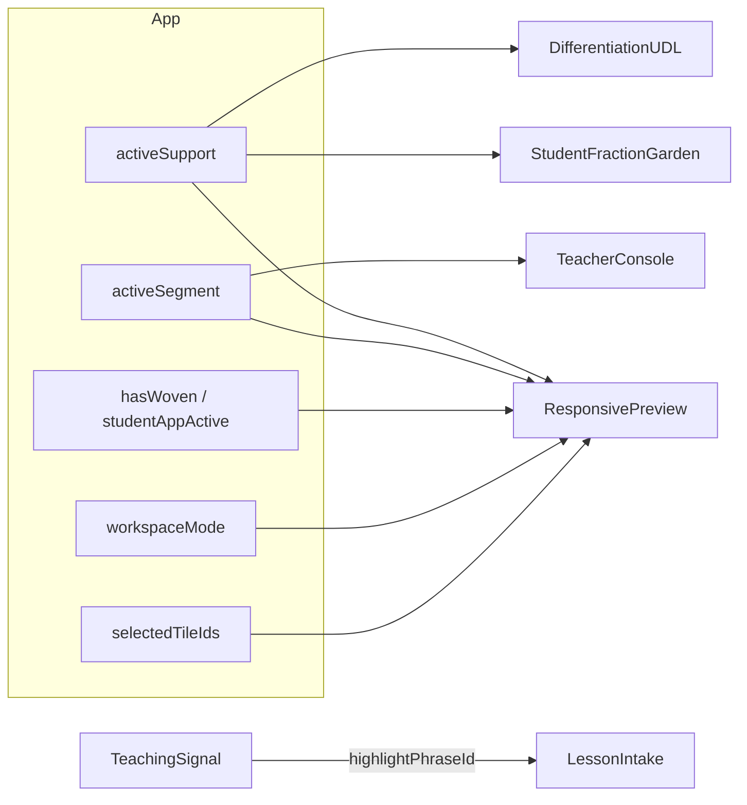
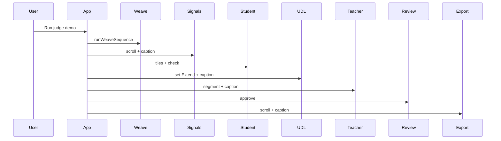

# feat: Unified System Wow — Classroom Session Coupling & Judge Narrative

## Summary

Wire Lesson Loom’s isolated panels into one **classroom session** so Support/Core/Extend and teacher timeline segments change what judges see in the student app and teacher console; mirror that state in the devices preview; deepen plan→signal grounding with phrase highlights; extend the judge demo through signals and UDL; and close remaining submission QA gaps—without backend, fake AI, or scope creep.

---

## Problem Frame

Phases A–D of the capability review are largely shipped (progress rail, editable intake, export zip, URL state, presenter captions). The prototype still reads as **polished parts** rather than a **unified system** because `activeSupport`, `activeSegment`, and `classMode` do not propagate beyond their sections (`src/App.tsx` analysis). Judges who skip autoplay miss the integration story; judges who use autoplay skip signals, UDL, and real interaction beats.

(see origin: `docs/superpowers/specs/2026-05-29-unified-system-wow-design.md`)

---

## Requirements

- R1. **Support lane drives student experience** — When the user selects Support, Core, or Extend in `DifferentiationUDL`, `StudentFractionGarden` shows that lane’s mission copy and scaffold hints from `lessonLoomData.differentiation` (deterministic; no profiling claims).
- R2. **Teacher segment drives console body** — When the user selects a timeline segment in `TeacherConsole`, the main panel body shows segment-specific prompts/moves from data (not only the active badge).
- R3. **Devices preview mirrors session** — `ResponsivePreview` receives live props: woven state, workspace mode, active support lane, active segment, and selected tile labels (or canonical demo labels when empty).
- R4. **Source phrase highlighting** — Clicking a teaching signal source scrolls to the plan and applies a visible highlight on the matching phrase in `#lesson-plan-draft` (in addition to existing focus behavior).
- R5. **Extended judge demo** — `runJudgeDemo` visits `#signals` and `#udl`, switches support lane at least once, updates presenter captions; prefers one real tile interaction when motion is not reduced.
- R6. **Export reflects session** — Client zip includes optional `reflection.txt` (or similar) when reflection was saved; export section shows subtle “approved” state when `approved` is true (copy-only, no new claims).
- R7. **Submission confidence** — `docs/qa/ACCEPTANCE_STATUS.md` updated for completed manual checks; `docs/submission/README.md` documents live URL verification steps; walkthrough script notes new demo beats.
- R8. **Verification** — `npm run verify` passes; new e2e covers R1–R5 critical paths.
- R9. **Claim safety** — No new language implying official curriculum, district approval, student profiling, or automated grading (`09_PRIVACY_CLAIM_SAFETY.md`).

---

## Key Technical Decisions

- KTD1. **Propagate session via App, not context** — Keep `App.tsx` as orchestrator; pass `activeSupport` into `StudentFractionGarden` and `ResponsivePreview` rather than introducing a new global store (matches existing patterns).
- KTD2. **Data-driven segment bodies** — Add `teacherSegmentBodies: Record<TimelineId, { title, prompts, watch }>` to `lessonLoomData.ts` instead of branching in JSX.
- KTD3. **Student lane = copy + light rules** — Support lane may filter which tiles appear (e.g., support: halves/fourths/eighths only) only if `fractionTiles` metadata includes `lanes: SupportLane[]`; otherwise copy-only to minimize regression risk.
- KTD4. **Phrase highlights via mark + state** — `highlightPhraseId: string | null` in App; intake renders marks for known `teachingSignals[].source` substrings; no NLP.
- KTD5. **Judge demo timing budget** — Target &lt; 90s total; add beats with ≤2s delays each; `prefers-reduced-motion` uses inject path only.
- KTD6. **System map is decorative** — Static SVG + CSS in `MadeWithStitch`; optional `data-active-step` from weave/approval; no new navigation behavior.

---

## High-Level Technical Design

### Session propagation

### Judge demo sequence (updated)

---

## Scope Boundaries

### In scope

Requirements R1–R9 above.

### Deferred to Follow-Up Work

- Playable second lesson (chips stay preview-only).
- iframe / true viewport resize for devices section.
- Self-hosted fonts.
- Workshop PDF generation.

### Outside this product's identity

Real Stitch API, LLM extraction, accounts, LMS, live analytics with PII.

---

## Assumptions

- Judges evaluate on Chromium; Safari manual pass remains best-effort.
- GitHub Pages URL in submission README is the deploy target.
- Extend lane copy changes are sufficient wow if tile filtering is risky for timeline.

---

## Implementation Units

### U1. Data model for segment bodies and lane-aware tiles

**Goal:** Centralize content needed for R1 and R2.

**Requirements:** R1, R2

**Dependencies:** None

**Files:**
- Modify: `src/data/lessonLoomData.ts`
- Modify: `src/data/presenterCaptions.ts` (additional caption strings for new demo beats)

**Approach:** Add `teacherSegmentBodies` keyed by `TimelineId`. Optionally add `lanes?: SupportLane[]` on fraction tile entries if filtering is in scope; document in data.

**Patterns to follow:** Existing `differentiation` and `teacherTimeline` objects.

**Test scenarios:**
- Happy path: each `TimelineId` key returns non-empty `prompts` array.
- Edge case: unknown segment id falls back to `partner` body.

**Verification:** TypeScript build; no runtime test file (data-only).

**Test expectation:** none — data shape only.

---

### U2. Classroom session coupling in App + Student + Teacher + UDL

**Goal:** R1 and R2 — toggles change downstream UI.

**Requirements:** R1, R2

**Dependencies:** U1

**Files:**
- Modify: `src/App.tsx`
- Modify: `src/components/sections/StudentFractionGarden.tsx`
- Modify: `src/components/sections/TeacherConsole.tsx`
- Modify: `src/components/sections/DifferentiationUDL.tsx`
- Modify: `src/styles/sections.css` (lane-specific mission styles if needed)

**Approach:** Pass `activeSupport` and `differentiation[activeSupport]` into student section. Pass `teacherSegmentBodies[activeSegment]` into teacher console. Optional: show `StatusPip` in UDL when `workspaceMode === 'student'` (“Previewing student lane: Extend”).

**Test scenarios:**
- Happy path: select Extend in UDL → student mission text includes extension language from data.
- Happy path: select `independent` segment → teacher body shows independent prompts (not partner copy).
- Edge case: switching workspace mode does not reset `activeSupport` or tiles.
- Integration: Support → Core → Extend cycle updates student copy without page reload.

**Verification:** `e2e/unified-session.spec.ts` (new).

**Files (tests):** `e2e/unified-session.spec.ts`

---

### U3. Live ResponsivePreview mirror

**Goal:** R3 — devices section reflects session.

**Requirements:** R3

**Dependencies:** U2

**Files:**
- Modify: `src/components/sections/ResponsivePreview.tsx`
- Modify: `src/App.tsx` (pass snapshot props)
- Modify: `src/styles/sections.css` (device frame active states)

**Approach:** Define `DevicesSnapshot` type in `lessonLoomData.ts` or `App.tsx`. Render active segment badge, lane label, woven pip, and tile chips from props.

**Test scenarios:**
- Happy path: after weave + Extend lane, phone frame shows Extend label and woven indicator.
- Happy path: teacher frame highlights active segment badge matching `activeSegment`.
- Edge case: empty `selectedTileIds` shows placeholder chips `1/2`, `2/4`, `3/6`.

**Verification:** extend `e2e/unified-session.spec.ts`.

---

### U4. Source phrase highlighting

**Goal:** R4 — grounding between signals and editable plan.

**Requirements:** R4

**Dependencies:** None (can parallel U2)

**Files:**
- Modify: `src/App.tsx` (`highlightPhraseId` state)
- Modify: `src/components/sections/LessonIntake.tsx`
- Modify: `src/components/sections/TeachingSignal.tsx`
- Modify: `src/styles/sections.css` (`.lesson-plan__phrase--active`)

**Approach:** Map `teachingSignals[].source` to phrase keys; on signal source click, set highlight id and scroll. Intake renders plan text with `<mark>` for known phrases or wraps on highlight id.

**Test scenarios:**
- Happy path: click “different fractions can represent the same amount” source → mark visible in plan.
- Edge case: edited plan text does not break layout (highlight best-effort if phrase removed).
- Regression: existing `e2e/source-phrase.spec.ts` still passes (focus behavior preserved).

**Verification:** `e2e/source-phrase.spec.ts` + highlight assertion.

---

### U5. Extended judge demo, system map, export session touches

**Goal:** R5, R6 — narrative and handoff polish.

**Requirements:** R5, R6

**Dependencies:** U2 (for UDL beat), U1 (captions)

**Files:**
- Modify: `src/App.tsx` (`runJudgeDemo`)
- Modify: `src/data/presenterCaptions.ts`
- Modify: `src/components/sections/MadeWithStitch.tsx` (system map)
- Modify: `src/utils/buildExportZip.ts`
- Modify: `src/components/sections/ExportPackSection.tsx`
- Modify: `src/styles/sections.css` (system map, approved export styling)

**Approach:** Insert scroll steps for `#signals`, `#udl` with `setActiveSupport('extend')`. Add one `page.click` on a fraction tile when not reduced motion. Add compact SVG system map. Append reflection to zip when `reflectionSaved`.

**Test scenarios:**
- Happy path: judge demo shows ≥6 presenter captions in order.
- Happy path: after demo, `approved` true and export section visible.
- Happy path: download zip when reflection saved includes reflection file.
- Edge case: reduced motion completes without extra delays &gt; 500ms per step.
- Integration: `e2e/judge-demo-console.spec.ts` still reports zero console errors.

**Verification:** `e2e/judge-demo.spec.ts` (new), `e2e/judge-demo-console.spec.ts`, `e2e/export-zip.spec.ts`.

---

### U6. Submission hardening & QA documentation

**Goal:** R7 — contest-ready confidence.

**Requirements:** R7, R8

**Dependencies:** U1–U5 (document after feature complete)

**Files:**
- Modify: `docs/qa/ACCEPTANCE_STATUS.md`
- Modify: `docs/submission/README.md`
- Modify: `docs/submission/WALKTHROUGH.md`
- Optional: `e2e/visual-widths.spec.ts` (screenshots at 1440, 1280, 1024, 430 via Playwright viewport)

**Approach:** Run manual matrix; check boxes with evidence. Update walkthrough script for signals + UDL beats. Add optional Playwright viewport smoke if time permits.

**Test scenarios:**
- Happy path: README lists live URL and verification date.
- Edge case: N/A items documented with reason (Safari if unavailable in CI).

**Verification:** `npm run verify` and `npm run verify:submission` if screenshots updated.

**Test expectation:** none for manual QA doc — optional viewport spec if added.

---

## System-Wide Impact

- **End users (judges/teachers):** Clearer “one lesson” story; slightly longer judge demo.
- **Developers:** More props from App; data additions must stay claim-safe.
- **CI:** +1–2 e2e specs; verify time may increase ~10–15s.

---

## Risks & Dependencies

| Risk | Mitigation |
|------|------------|
| Demo too long | Cap delays; test wall-clock in e2e with loose timeout |
| Tile filter breaks fraction check | Ship copy-only first; gate filter behind tile `lanes` metadata |
| Phrase highlight fragile on edit | Best-effort match; clear highlight on draft change |

**Prerequisites:** `main` at current baseline; Playwright chromium installed for CI.

---

## Sources & Research

- `docs/superpowers/specs/2026-05-29-unified-system-wow-design.md`
- `docs/superpowers/plans/2026-05-28-capability-review-and-future-enhancements.md`
- `docs/qa/ACCEPTANCE_STATUS.md`
- `AGENTS.md`, `14_BUILD_EXECUTION_BRIEF.md`, `16_INTERACTION_AND_MOTION_SPEC.md`
- Repo research: disconnected state in `App.tsx`; decorative `ResponsivePreview.tsx`

---

## Suggested PR sequence

1. `feat(data): segment bodies and demo captions` — U1  
2. `feat(session): lane + segment coupling` — U2 + U4  
3. `feat(devices): live responsive preview` — U3  
4. `feat(demo): judge narrative + system map + export` — U5  
5. `chore(qa): submission hardening` — U6  

---

## Acceptance (plan complete when)

- [x] R1–R6 demonstrable in local dev and covered by e2e where specified  
- [x] R7 manual matrix progressed with dated notes  
- [x] `npm run verify` green  
- [x] No new claim-safety violations  
