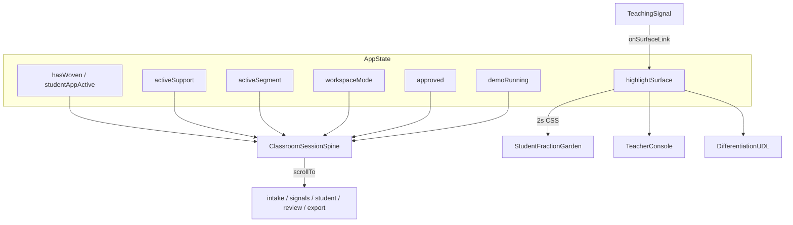
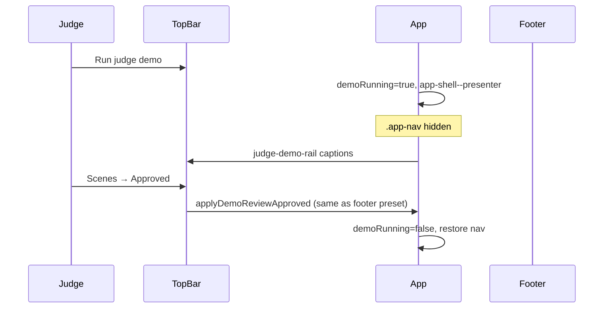

# feat: Judge Wow Phase 3 — Visible Unified Session & Submission Closure

## Summary

Close the remaining contest-submission gaps and make Lesson Loom’s **already-coupled classroom session** obvious at a glance: a sticky session spine, bidirectional teaching-signal grounding into student/teacher/UDL surfaces, screenshot-grade visual polish, and judge presentation tools (top-bar Scenes, presenter chrome)—without backend, fake AI, or a second lesson.

(see origin: `docs/superpowers/specs/2026-05-30-judge-wow-phase-3-design.md`)

---

## Problem Frame

Phases 1–2 shipped functional unity: support lanes change student copy, teacher segments change console bodies, devices mirror state, approval/reflection/class mode propagate, and the judge demo walks the full arc with presenter captions. Automated e2e covers most functional acceptance (`docs/qa/ACCEPTANCE_STATUS.md`).

Judges who **explore manually** still experience capable panels connected mainly by scroll—not a single live classroom session. Manual QA still flags product perception, visual polish, walkthrough video, and Safari. Phase 2 deferred top-bar **Scenes** (presets live only in the footer).

Phase 3 optimizes for **integration + care** as the contest differentiator: the unified suite should read as one system within 30 seconds, in screenshots, and in a 60–90s recording.

---

## Requirements

- **R1. Session spine visibility** — After weave (or during judge demo), a compact sticky spine shows Plan → Signals → Lesson → Review → Export with a derived subline (lane, segment, approval, workspace mode). Hidden on hero before weave.
- **R2. Spine navigation** — Each spine pip scrolls to the correct section; Lesson pip respects student vs teacher workspace mode when navigating to `#student` or `#teacher`.
- **R3. Signal → surface linking** — Teaching signals with `surfaceLinks` expose a navigational “See in lesson” control that scrolls to student, teacher, or UDL and applies a brief surface highlight (CSS, reduced-motion safe).
- **R4. Workspace mode on link** — Navigating to student or teacher surfaces switches `workspaceMode` when needed; UDL does not force mode change.
- **R5. Perception polish** — Hero eyebrow/headline hierarchy and garden tile/bed tactility meet the visual checklist in `docs/qa/ACCEPTANCE_STATUS.md` (manual sign-off documented).
- **R6. Judge Scenes menu** — Top bar exposes Reset / Success / Approved presets using the same handlers as `SiteFooter` (`applyDemoReset`, `applyDemoSuccessState`, `applyDemoReviewApproved`).
- **R7. Presenter chrome** — During `demoRunning`, side navigation (`.app-nav`) is hidden; top bar, demo rail, and presenter caption remain visible.
- **R8. Submission closure** — `docs/qa/MANUAL_PASS_2026-05-30.md` completed; walkthrough video URL in `docs/submission/README.md`; remaining manual ACCEPTANCE rows checked or marked N/A with reason.
- **R9. Verification** — `npm run verify` passes; new e2e covers R1–R4, R6–R7; `e2e/copy-deck.spec.ts` unchanged for claim safety.
- **R10. Scope boundary** — No second lesson, real device iframes, LLM re-extract on plan edit, student accounts, LMS, or compliance overclaims (`AGENTS.md`, `09_PRIVACY_CLAIM_SAFETY.md`).

---

## Key Technical Decisions

- **KTD1. App.tsx remains orchestrator** — Add `highlightSurface: SignalSurfaceLink | null` and spine props only; no new global store or context (matches Phase 1–2 pattern).
- **KTD2. Spine active step uses existing `systemMapStep`** — Reuse `systemMapStep` (0–4) aligned with `MadeWithStitch` system map; optionally refine with `activeNav` intersection for Lesson pip only if scroll spy already stable.
- **KTD3. Real layout class names** — Target `.app-topbar`, `.app-nav`, `.app-shell` (not generic `.top-bar` / `.side-nav` from design drafts).
- **KTD4. `surfaceLinks` is data-only** — Extend `teachingSignals[]` in `lessonLoomData.ts`; map metaphor/interaction/assessment/differentiation to student/teacher/udl deterministically; no NLP or re-extract on plan edit.
- **KTD5. Surface highlight is ephemeral** — `setHighlightSurface` + 2s timeout; CSS class `ll-surface-highlight` on section wrapper; no GSAP requirement; honor reduced motion (instant on/off).
- **KTD6. Scenes menu reuses preset callbacks** — Extract or import the same three handlers passed to `SiteFooter`; top-bar `<select>` with `data-testid="judge-scenes"` resets value after selection.
- **KTD7. Presenter chrome is demo-gated** — `app-shell--presenter` class when `demoRunning`; do not add a separate user toggle in Phase 3 (avoids chrome-mode proliferation).
- **KTD8. Submission Phase I is parallelizable** — Manual video/Safari can complete while code phases J–L ship; do not block merge on video URL in code PRs.
- **KTD9. Execution detail** — Step-level code and command choreography live in `docs/superpowers/plans/2026-05-30-judge-wow-phase-3.md` for agents that want checkbox tasks; this plan is the decision and traceability layer.

---

## High-Level Technical Design

### Session + spine + highlights

### Judge presentation layer

### Phased delivery

| Phase | Units | Outcome |
|-------|-------|---------|
| **I** Submission | U1–U2 | Manual evidence + video link |
| **J** Perception | U3 | Screenshot-grade hero/garden/cards |
| **K** Unified visibility | U4–U6 | Spine + signal links + e2e |
| **L** Judge presentation | U7–U8 | Scenes + presenter chrome + e2e |

---

## Scope Boundaries

### In scope

Phases I–L as defined in origin spec; four new e2e specs; `ACCEPTANCE_STATUS.md` updates; optional cross-link from `docs/submission/RECORDING.md` beat sheet (already drafted in superpowers plan).

### Deferred to follow-up work

- Second playable lesson or subject chips enabled
- Real responsive iframe / live device lab
- LLM or regex “re-weave” when lesson plan text changes
- Confetti or heavy celebration animations
- Separate presenter-mode toggle outside judge demo
- Post-contest PrairieSignal pilot features (`04_STRATEGIC_ROADMAP.md` P4)

### Outside this product's identity

Student accounts, LMS integration, automated grading, district/compliance claims, real Stitch API calls.

---

## System-Wide Impact

- **Judges / Contra reviewers** — Faster “one system” comprehension; autoplay and manual exploration align.
- **Teachers (demo audience)** — Clearer navigational grounding from signals to lesson surfaces.
- **Maintainers** — New `ClassroomSessionSpine` component; `lessonLoomData` signal metadata grows slightly; e2e suite +4 specs.
- **CI** — `npm run verify` runtime increases marginally; no new dependencies expected for Phase 3 UI.

---

## Risks & Dependencies

| Risk | Mitigation |
|------|------------|
| Spine reads as SaaS dashboard | Max 5 pips, one subline, hidden until weave |
| Sticky spine overlaps top bar on mobile | Test 430px; adjust `top` offset to match `.app-topbar` height |
| Signal link implies AI applied | Label “See in lesson”; no “generated” language |
| Presenter mode hides critical controls | Only hide `.app-nav`; keep top bar + captions |
| Manual video blocks “done” | Track Phase I separately from code PRs |
| Class name drift in e2e | Use `data-testid` for spine, scenes, highlight |

**Dependencies:** `main` with Phase 2 merged; Playwright Chromium for CI; GitHub Pages URL for manual smoke.

---

## Implementation Units

### U1. Manual QA evidence template

**Goal:** Create a durable manual pass document for Phase 3 submission closure.

**Requirements:** R8

**Dependencies:** None

**Files:**
- Create: `docs/qa/MANUAL_PASS_2026-05-30.md`
- Modify: `docs/qa/ACCEPTANCE_STATUS.md` (link to manual pass at top)

**Approach:** Template sections for product perception, visual, responsive, a11y, browser, submission, video URL. Checkbox per open ACCEPTANCE row.

**Test scenarios:** Test expectation: none — documentation only.

**Verification:** File exists; ACCEPTANCE_STATUS links to it.

---

### U2. Submission README and recording alignment

**Goal:** Wire submission docs for video URL and Phase 3 recording beats.

**Requirements:** R8

**Dependencies:** U1

**Files:**
- Modify: `docs/submission/README.md`
- Modify: `docs/submission/RECORDING.md`

**Approach:** Add placeholder for recorded walkthrough URL; ensure beat sheet references session spine and Scenes menu once shipped (note “optional” until U4/U7 land).

**Test scenarios:** Test expectation: none — documentation only.

**Verification:** Human can follow RECORDING.md without ambiguity; README lists manual steps remaining.

---

### U3. Perception polish (hero, garden, panels)

**Goal:** Meet screenshot/video visual checklist without layout regression.

**Requirements:** R5

**Dependencies:** None (can parallel U1)

**Files:**
- Modify: `src/styles/tokens.css`
- Modify: `src/styles/sections.css`
- Modify: `src/styles/primitives.css`
- Modify: `src/components/sections/HeroLanding.tsx` (only if markup hierarchy needs adjustment)

**Approach:**
- Add `--ll-eyebrow` token for contrast on ivory
- Strengthen `.hero-visual` grid (stack at 768px)
- Tile shadow + selected state; `garden-bed--active` fill when plots filled
- Unify panel shadow via `--ll-shadow-soft`

**Patterns to follow:** Existing `--ll-focus-ring`, `Panel` / `.ll-panel` usage, `03_DESIGN.md` warm ivory palette.

**Test scenarios:**
- Happy path: at 1440px after weave, hero H1 and eyebrow visible; garden tiles show border/shadow.
- Edge case: 430px viewport — no horizontal overflow (regression against `e2e/viewports.spec.ts`).
- Happy path: selected tile shows stronger shadow/focus ring.

**Verification:** `npm run verify` green; manual sign-off in U1 for “screenshot-worthy” and ivory/typography rows.

---

### U4. Data model — surfaceLinks and spine subline

**Goal:** Extend teaching signal metadata and spine copy helper.

**Requirements:** R3, R1

**Dependencies:** None

**Files:**
- Modify: `src/data/lessonLoomData.ts`

**Approach:**
- Export `SignalSurfaceLink = 'student' | 'teacher' | 'udl'`
- Add `surfaceLinks?: SignalSurfaceLink[]` per signal (e.g. `metaphor` → `['student']`, `interaction` → `['student']`, `differentiation` → `['udl']`, `assessment` → `['teacher']`)
- Add `sessionSpineSubline(...)` pure function from lane, segment, approval, workspace mode

**Patterns to follow:** Existing `DevicesSnapshot`, `teacherSegmentBodies` patterns in same file.

**Test scenarios:** Test expectation: none at data layer — covered by U5–U6 e2e.

**Verification:** Typecheck passes; no copy-deck violations in new strings.

---

### U5. ClassroomSessionSpine component

**Goal:** Sticky five-pip spine with subline and section navigation.

**Requirements:** R1, R2

**Dependencies:** U4

**Files:**
- Create: `src/components/ClassroomSessionSpine.tsx`
- Modify: `src/styles/layout.css`
- Modify: `src/App.tsx`

**Approach:**
- Render when `hasWoven || demoRunning`
- Pips: Plan `#intake`, Signals `#signals`, Lesson `#student` or `#teacher` based on `workspaceMode`, Review `#review`, Export `#export`
- `activeStepIndex={systemMapStep}` (validate mapping: plan=0 … export=4)
- `data-testid="session-spine"`; buttons are real `<button>` elements
- Sticky below `.app-topbar`; use existing topbar height token or measure `--ll-topbar-height`

**Patterns to follow:** `ProgressRail`, `StatusPip`, `MadeWithStitch` system map step semantics.

**Test scenarios:**
- Happy path: after weave, spine visible with subline containing lane name.
- Happy path: click Export pip → `#export` in viewport.
- Edge case: before weave, spine not in DOM (or hidden).

**Verification:** Covered by U6 `e2e/session-spine.spec.ts`.

---

### U6. Signal surface links and highlight state

**Goal:** Bidirectional grounding from signals to lesson surfaces.

**Requirements:** R3, R4

**Dependencies:** U4, U5

**Files:**
- Modify: `src/components/sections/TeachingSignal.tsx`
- Modify: `src/App.tsx`
- Modify: `src/components/sections/StudentFractionGarden.tsx`
- Modify: `src/components/sections/TeacherConsole.tsx`
- Modify: `src/components/sections/DifferentiationUDL.tsx`
- Modify: `src/styles/sections.css`

**Approach:**
- App holds `highlightSurface` + `handleSignalSurfaceLink` (scroll via `useScrollToSection`, mode switch, 2s clear)
- TeachingSignal: secondary “See in lesson” when `surfaceLinks?.length`; `data-testid={`signal-link-${id}`}`
- Section wrappers: conditional `ll-surface-highlight` class

**Patterns to follow:** `highlightPhraseId` + source phrase flow in `TeachingSignal` / `LessonIntake`.

**Test scenarios:**
- Happy path: after weave, click `signal-link-metaphor` → `#student` in viewport, student section has highlight class.
- Happy path: link targeting teacher switches workspace to teacher (assert teacher console visible).
- Edge case: reduced motion — highlight still appears without animation dependency.

**Verification:** `e2e/signal-surface-link.spec.ts` passes; `e2e/copy-deck.spec.ts` passes.

---

### U7. Top-bar Scenes menu

**Goal:** Duplicate footer demo presets in top bar for judges who do not scroll.

**Requirements:** R6

**Dependencies:** None (uses existing App callbacks)

**Files:**
- Modify: `src/App.tsx` (markup in `.app-topbar`)
- Modify: `src/styles/layout.css`

**Approach:**
- `<select data-testid="judge-scenes">` with options reset / success / approved
- `onChange` invokes same functions as `SiteFooter` presets; reset select value to `""` after action
- Accessible label via `.sr-only` or `aria-label`

**Patterns to follow:** `data-testid="demo-preset-*"` in `SiteFooter.tsx`.

**Test scenarios:**
- Happy path: load `/?w=1#export`, select Approved → export approved pip or approved copy visible.
- Happy path: select Reset → weave state cleared (banner hidden or step 0).

**Verification:** `e2e/judge-scenes.spec.ts` passes.

---

### U8. Presenter chrome during judge demo

**Goal:** Hide side nav during autoplay for cleaner recording.

**Requirements:** R7

**Dependencies:** None

**Files:**
- Modify: `src/App.tsx`
- Modify: `src/styles/layout.css`

**Approach:**
- Add `app-shell--presenter` to shell when `demoRunning`
- CSS: `.app-shell--presenter .app-nav { display: none }` and expand `.app-main` margin
- Do not hide top bar, judge rail, or `presenter-caption`

**Test scenarios:**
- Happy path: click Run judge demo → `.app-nav` hidden.
- Happy path: after demo completes → `.app-nav` visible again.
- Integration: judge demo still completes full arc (`e2e/judge-demo.spec.ts` regression).

**Verification:** `e2e/presenter-mode.spec.ts` passes; `e2e/judge-demo.spec.ts` passes.

---

### U9. E2e suite for Phase 3 behaviors

**Goal:** Lock R1–R4, R6–R7 with Playwright coverage.

**Requirements:** R9

**Dependencies:** U5, U6, U7, U8

**Files:**
- Create: `e2e/session-spine.spec.ts`
- Create: `e2e/signal-surface-link.spec.ts`
- Create: `e2e/judge-scenes.spec.ts`
- Create: `e2e/presenter-mode.spec.ts`

**Approach:** Follow existing patterns: `goto('/')`, `weave-lesson` or `?w=1`, `data-testid` selectors, generous timeouts for weave animation.

**Execution note:** Run full `npm run verify` after all four specs land.

**Test scenarios:** As defined per file in U5–U8.

**Verification:** All four specs pass in Chromium CI project.

---

### U10. Close manual acceptance and sign-off

**Goal:** Complete human submission package.

**Requirements:** R8, R5 (manual visual rows)

**Dependencies:** U1, U2, U3–U9 (code complete)

**Files:**
- Modify: `docs/qa/MANUAL_PASS_2026-05-30.md`
- Modify: `docs/qa/ACCEPTANCE_STATUS.md`
- Modify: `docs/submission/README.md`

**Approach:**
- Run `npm run verify` and `npm run capture:screenshots`
- Record 60–90s video per RECORDING.md
- Safari: test or mark N/A
- Check remaining manual rows with `_manual pass 2026-05-30_`

**Test scenarios:** Test expectation: none — human verification.

**Verification:** MANUAL_PASS fully checked; video URL in README; ACCEPTANCE_STATUS ≥90% checked with dated notes.

---

## Open Questions

| Question | Status | Resolution |
|----------|--------|------------|
| Should Lesson spine pip split into Student/Teacher pips? | Deferred | Keep single “Lesson” pip; subline shows workspace mode (KTD2) |
| Auto-enable presenter chrome for manual recording without demo? | Deferred | Phase 3 only ties to `demoRunning` (KTD7) |
| Self-host Google Fonts for offline demo? | Deferred | Out of Phase 3; note in manual pass if offline risk matters |

---

## Documentation Plan

- Update `docs/qa/ACCEPTANCE_STATUS.md` per phase completion
- Add automated rows for session spine, signal links, scenes, presenter when e2e lands
- `docs/submission/WALKTHROUGH.md` — optional one-line mention of spine + Scenes after U5/U7

---

## Sources & Research

| Source | Use |
|--------|-----|
| `docs/superpowers/specs/2026-05-30-judge-wow-phase-3-design.md` | Origin requirements and phases |
| `docs/superpowers/plans/2026-05-30-judge-wow-phase-3.md` | Checkbox execution tasks |
| `docs/qa/ACCEPTANCE_STATUS.md` | Remaining manual gaps |
| `AGENTS.md` | Scope and state model |
| `14_BUILD_EXECUTION_BRIEF.md` | Build priorities |
| `09_PRIVACY_CLAIM_SAFETY.md` | Copy constraints |
| `18_RED_TEAM_REVIEW.md` | Dashboard clutter risk |
| `src/App.tsx` | Orchestrator and preset handlers |
| `e2e/unified-session.spec.ts`, `e2e/judge-demo.spec.ts` | E2e conventions |

---

## Acceptance (plan-level)

- [ ] R1–R10 satisfied or explicitly deferred with reason
- [ ] `npm run verify` green after U9
- [ ] Manual pass U10 complete before Contra submit
- [ ] No new prohibited claims in UI copy
