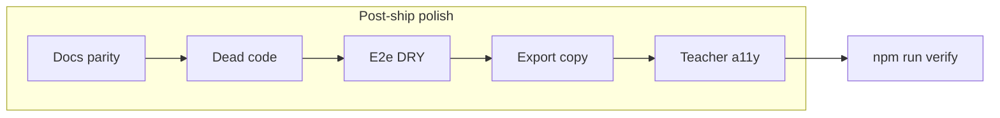

# fix: Thermo post-ship polish (deferred + should-fix)

## Summary

Close the remaining Thermo **should-fix** and low-risk hygiene items after the 2026-05-29 re-audit at `476d80d`, without reopening deferred architecture work (monolithic `App.tsx`, `hasWoven` prop drilling) or adding product scope. Every unit must leave `npm run verify` green.

## Problem Frame

The judge path is ship-ready (0 Must-fix, 53/53 e2e). Thermo branch and code-quality passes left a bounded backlog: doc/code drift, e2e duplication, minor a11y parity, export UX clarity, and dead exports. This plan sequences that backlog so an implementer can land it in small, verifiable commits.

---

## Requirements

- R1. `npm run verify` passes after all in-scope units (build, lint, typecheck, smoke 3/3, e2e 53/53).
- R2. No regression on judge-path behaviors documented in `docs/APPLICATION_COMPLETE.md` (weave gating, export copy, demo URL, presenter demo, tab roving).
- R3. Documentation accurately describes client-side demo zip vs LMS pipeline (README + Thermo resolution notes).
- R4. E2e hero-weave flows use shared helpers where they wait for post-weave banner (Q11).
- R5. No banned trust strings introduced in `src/` UI (per `09_PRIVACY_CLAIM_SAFETY.md`).
- R6. Teacher class-mode toggle matches workspace toggle a11y pattern (`aria-pressed`).

---

## Scope Boundaries

### In scope

- Thermo should-fix / polish from re-audit synthesis
- Dead code and doc drift (styles shim, `equivalentHalfIds`, AGENTS path references)
- E2e maintainability (helper adoption)
- Export section copy clarity (without breaking pre-weave zip download test)
- Teacher console a11y parity

### Deferred for later (Thermo — do not implement here)

- Q2: Split `App.tsx` god-object / extract judge demo module
- Q3: Context provider for `hasWoven`
- Q6: Reduce weave entry points
- Q12: Shorten judge-demo e2e timeouts
- Hero eyebrow “AI-native” copy change (locked by `e2e/copy-deck.spec.ts` + `17_COPY_DECK.md`)

### Outside this product's identity

- Backend, auth, real AI, LMS integration, new lessons, dashboards

### Deferred to Follow-Up Work

- ~~E2e coverage for `weave-lesson-panel` and intake “Extract” CTAs~~ — **Done** (`e2e/weave-entry-points.spec.ts`, `weave-lesson-intake` testid)
- `primitives.css` — kept as legacy reference (not imported); documented in `src/styles/README.md`
- Gate zip download on `hasWoven` — **Declined** (KTD1: pre-weave zip is intentional demo handoff)

---

## Key Technical Decisions

- KTD1. **Keep zip download enabled pre-weave:** `e2e/export-zip.spec.ts` intentionally downloads without weaving; align *copy* only (`export-lock-notice`, status pip labels), not button `disabled`.
- KTD2. **Single CSS entry remains `src/styles/index.css`:** Remove orphan `src/styles.css` shim; update `AGENTS.md` §7 structure to match `src/styles/` split (do not reintroduce monolith).
- KTD3. **Extend `weaveFromHero` with optional timeout:** Default 15s for full-motion weave; allow shorter timeout for `e2e/reduced-motion.spec.ts` where banner appears immediately.
- KTD4. **Do not change hero “AI-native” string:** Copy deck and copy-deck e2e enforce it; trust polish stays on footer/review/export language only.
- KTD5. **Export status pip uses `studentAppActive` when tightening timing:** If adjusting “All files generated”, gate on `hasWoven && activeWeaveStep >= weaveSteps.length - 1` (passed from `App.tsx`) to avoid the ~820ms window where copy unlocks before banner.

---

## High-Level Technical Design

---

## Implementation Units

### U1. Documentation parity (Thermo + AGENTS)

**Goal:** Judges and agents see accurate “real vs prototype” and post-polish Thermo status.

**Requirements:** R3

**Dependencies:** None

**Files:**

- `README.md` (verify zip line — may already be correct on branch)
- `docs/THERMO_AUDIT_RESOLUTION.md`
- `docs/APPLICATION_COMPLETE.md`
- `AGENTS.md` (§7 recommended structure: `src/styles/index.css` chain, not root `styles.css`)

**Approach:**

- Confirm README “What is real vs prototype” lists client-side demo zip under **Real** and LMS/server pipeline under **Demo**.
- Add a short **Post-polish (2026-05-30)** subsection to Thermo doc: Q11 helper adoption, styles shim removed, Q10 alias removed, teacher `aria-pressed`.
- Update `AGENTS.md` file tree to match actual `src/styles/` layout.

**Patterns to follow:** Existing Thermo table format in `docs/THERMO_AUDIT_RESOLUTION.md`.

**Test scenarios:**

- Test expectation: none — documentation only; spot-check links/paths render in GitHub preview.

**Verification:** README and Thermo doc agree on zip behavior; AGENTS structure matches repo.

---

### U2. Dead code and style entrypoint cleanup

**Goal:** Remove drift that confuses agents (orphan CSS shim, deprecated data export).

**Requirements:** R1, R2

**Dependencies:** U1 (doc mentions removal)

**Files:**

- `src/styles.css` (delete)
- `src/data/lessonLoomData.ts`
- `src/styles/README.md` (if present — note `primitives.css` legacy)
- `07_CONTENT_MODEL_AND_SAMPLE_DATA.md` (optional: update example constant name to `equivalentCanonicalIds`)

**Approach:**

- Delete `src/styles.css`; confirm nothing imports it (`main.tsx` already uses `styles/index.css`).
- Remove `equivalentHalfIds` deprecated export; grep repo for references and fix planning-doc examples only.
- Leave `primitives.css` in place unless explicitly deleting — document as legacy in `src/styles/README.md` if not already.

**Patterns to follow:** Prior removal of `sections.css` and `useLessonLoomFlow.ts` at `476d80d`.

**Test scenarios:**

- Happy path: `npm run build` succeeds with no missing import.
- Edge case: `rg equivalentHalfIds` returns no `src/` hits after removal.

**Verification:** Build passes; no broken imports.

---

### U3. E2e DRY — `weaveFromHero` adoption (Q11)

**Goal:** One place to tune hero-weave wait semantics; reduce copy-paste in ~10 specs.

**Requirements:** R1, R4

**Dependencies:** U2 (optional ordering — can run in parallel)

**Files:**

- `e2e/helpers.ts`
- `e2e/accessibility.spec.ts`
- `e2e/capture-screenshots.spec.ts`
- `e2e/export-zip.spec.ts` (second test only)
- `e2e/phase2-session.spec.ts`
- `e2e/reduced-motion.spec.ts`
- `e2e/responsive-tablet.spec.ts`
- `e2e/session-spine.spec.ts`
- `e2e/smoke.spec.ts` (golden path test)
- `e2e/source-phrase.spec.ts`
- `e2e/unified-session.spec.ts`

**Approach:**

- Extend helper signature, e.g. `weaveFromHero(page, { bannerTimeoutMs?: number })` defaulting to 15000.
- Replace inline `click` + `expect(banner)` pairs with helper import.
- **Do not** use helper in `export-zip.spec.ts` first test (no weave) or `copy-deck.spec.ts` (visibility-only).
- For `reduced-motion.spec.ts`, pass shorter timeout (e.g. 4000) matching current spec.

**Patterns to follow:** Existing usage in `e2e/signal-surface-link.spec.ts`, `e2e/fraction-check.spec.ts`.

**Test scenarios:**

- Happy path: full `npm run test:e2e` — 53/53 pass.
- Regression: `reduced-motion` weave still completes with short timeout.
- Regression: `smoke` golden path unchanged behavior.

**Verification:** `npm run test:e2e` green; no duplicate hero-weave blocks outside helper (except intentional exceptions).

---

### U4. Export section UX clarity (copy vs download)

**Goal:** Resolve Thermo narrative mismatch without gating zip download.

**Requirements:** R1, R2, R3

**Dependencies:** U1

**Files:**

- `src/components/sections/ExportPackSection.tsx`
- `src/App.tsx` (only if passing `studentAppActive` for status pip — optional)
- `e2e/smoke.spec.ts` (if lock notice text changes)

**Approach:**

- Update `export-lock-notice` to state that **per-file copy** requires weave; **demo zip** remains available as prototype handoff (or similar one-sentence split).
- Optional (KTD5): Change status pip “All files generated” to use `studentAppActive` prop from `App.tsx` instead of `hasWoven` alone.
- Do **not** add `disabled={!hasWoven}` on download button.

**Patterns to follow:** Existing `disabled={!hasWoven}` on copy buttons; `handleExportCopy` guard in `App.tsx`.

**Test scenarios:**

- Happy path: `e2e/export-zip.spec.ts` — download without weave still passes.
- Happy path: `e2e/smoke.spec.ts` — pre-weave copy disabled + lock notice visible.
- Happy path: post-weave copy enabled after weave.

**Verification:** Export e2e + smoke export assertions pass.

---

### U5. Teacher console class-mode a11y (R6)

**Goal:** Parity with `WorkspaceModeToggle` for screen readers and keyboard users.

**Requirements:** R1, R6

**Dependencies:** None

**Files:**

- `src/components/sections/TeacherConsole.tsx`
- `e2e/accessibility.spec.ts` (extend workspace test pattern)

**Approach:**

- Add `aria-pressed={classMode === 'whole'}` and `aria-pressed={classMode === 'groups'}` on class-mode buttons.
- Optional: `data-testid="class-mode-whole"` / `class-mode-groups` for e2e.
- Add accessibility spec: after weave (or navigate to teacher section), click groups button and assert `aria-pressed` on active control.

**Patterns to follow:** `src/components/ui/WorkspaceModeToggle.tsx` (`aria-pressed` + `role="group"`).

**Test scenarios:**

- Happy path: Whole Class button has `aria-pressed="true"` on load (default).
- Happy path: Click Small Groups → groups `aria-pressed="true"`, whole `false`.
- Keyboard: Enter/Space on inactive button switches mode (mirror workspace toggle behavior if applicable).

**Verification:** New/extended `accessibility.spec.ts` passes; `npm run verify` green.

---

## Risks & Dependencies

| Risk | Mitigation |
|------|------------|
| E2e helper timeout too short on slow CI | Keep 15s default; only reduced-motion overrides |
| Copy change breaks smoke string match | Update smoke assertion if lock notice text changes |
| Accidental zip gate | Code review: download button stays enabled; export-zip test 1 unchanged |

**Prerequisite:** Branch at or after `476d80d` with green verify baseline.

---

## Sources & Research

- `docs/THERMO_AUDIT_RESOLUTION.md` — re-audit @ `476d80d`, Q1–Q12 status
- Thermo branch + code-quality subagent synthesis (2026-05-29 session)
- `AGENTS.md` — scope boundaries, verify gate, no Q2/Q3 refactor
- `09_PRIVACY_CLAIM_SAFETY.md` — trust copy rules

---

## Acceptance (plan complete when)

- [ ] All U1–U5 verification criteria met
- [ ] `npm run verify` pasted in PR or session notes
- [ ] Thermo doc lists post-polish completion date and commit SHA
