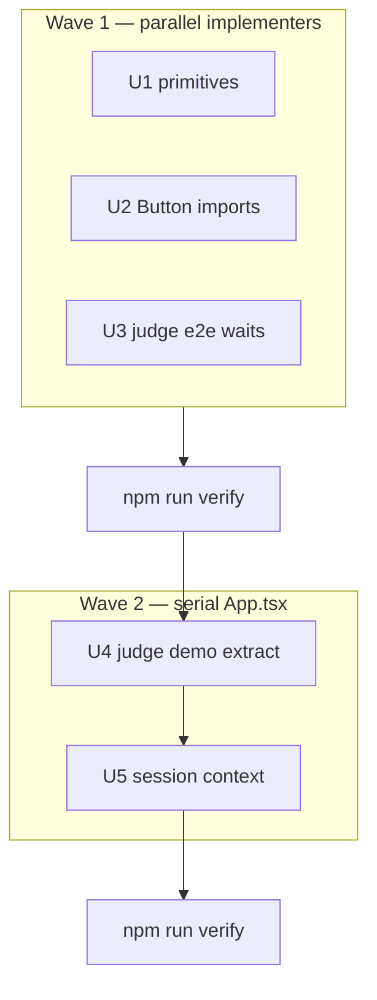

# refactor: Deferred Thermo architecture (subagent-driven)

## Summary

Execute the remaining **Thermo-deferred** maintainability work (Q2 partial extract, Q3 narrow context, Q12 e2e timing, legacy CSS cleanup) using **subagent-driven development**: one implementer subagent per implementation unit, then spec-compliance review, then code-quality review, with **parallel implementer dispatch only across file-disjoint units**.

Prerequisite: merge or rebase onto `fix/thermo-post-ship-polish` (commit `19f9f3d`) so Wave 1 starts from post-polish baseline (`npm run verify` → 56/56 e2e).

---

## Problem Frame

Post-polish (`19f9f3d`) closed Thermo should-fix items. Structural debt remains in `App.tsx` (~721 lines), legacy `primitives.css`, and long judge-demo e2e waits. This plan sequences deferred work without reopening accepted product choices (four weave CTAs, pre-weave zip download, hero “AI-native” copy).

---

## Requirements

- R1. `npm run verify` green after every wave and at completion.
- R2. Judge-path behavior unchanged (weave gating, demo URL, presenter demo, export gates, tab roving).
- R3. `App.tsx` line count reduced by at least ~120 lines via demo extraction (measurable outcome for Q2).
- R4. `hasWoven` / `studentAppActive` prop drilling reduced for export + student/teacher shells via a **narrow** context (Q3) — not a full state rewrite.
- R5. Judge-demo e2e uses **milestone testids** where possible; fixed sleeps only where GSAP timing requires (Q12).
- R6. `primitives.css` removed or archived with no import regressions.
- R7. Subagent workflow: no parallel implementers touching the same file.

---

## Scope Boundaries

### In scope

- Extract judge demo + demo scene presets from `App.tsx`
- Optional narrow `LessonLoomSessionContext` for weave/session flags
- E2e judge-demo timeout tightening
- Legacy `primitives.css` removal/archive
- Optional: migrate `IndustrialButton` imports to `Button` in section components (Q8 naming cleanup)

### Deferred for later (Thermo — still out of scope)

- Full `App.tsx` decomposition (weave GSAP, intersection nav, all state in hooks)
- Reducing weave entry points (Q6 accepted)
- Gating zip download on `hasWoven`
- Changing hero “AI-native” eyebrow
- Backend, auth, new product features

### Outside this product's identity

- LMS, real AI, accounts, multi-lesson SaaS

---

## Execution model (subagent-driven development)

Follow the **subagent-driven-development** skill for the parent orchestrator.

### Per implementation unit

1. **Orchestrator** dispatches one **implementer** subagent with the full unit block below (goal, files, approach, test scenarios, verification) — do not make subagents read this plan file.
2. Implementer implements, runs targeted tests, self-reviews, **does not commit** unless orchestrator policy says otherwise (recommended: orchestrator commits per unit after reviews pass).
3. **Spec-compliance** subagent: confirms unit matches requirements only — no extra scope.
4. **Code-quality** subagent: structure, patterns, no spaghetti in `App.tsx`.
5. If either reviewer fails → same implementer fixes → re-review until both pass.
6. Orchestrator runs `npm run verify` at end of each **wave**.

### Parallel dispatch rules

| Rule | Detail |
|------|--------|
| **Parallel OK** | Units in the same wave with **zero file-path overlap** in `Files:` |
| **Serial required** | Any unit touching `src/App.tsx` |
| **Never** | Two implementer subagents editing `App.tsx` concurrently |
| **Model** | Mechanical units → fast model; `App.tsx` extract + context → standard/capable model |

### Wave diagram

---

## Key Technical Decisions

- KTD1. **Extract demo first, context second:** `runJudgeDemo` and scene presets move to `src/demo/` before introducing React context, so U5 only wires existing props into provider.
- KTD2. **Narrow context only:** Context exposes `hasWoven`, `studentAppActive`, `approved`, `workspaceMode`, `activeSupport` — not lesson draft, timers, or judge demo state.
- KTD3. **Preserve DOM-click in judge demo** until refactor proven: `document.querySelector('[data-testid="tile-one-half"]')?.click()` may remain in extracted module initially; optional follow-up passes `handleToggleTile` via ref/callback.
- KTD4. **E2e waits:** Replace blind 8–12s sleeps with `expect(testId).toBeVisible()` on known milestones (`weave-complete-banner`, `presenter-caption`, `export-gate-approved`) and keep one bounded max timeout per spec.
- KTD5. **No zip gate:** Pre-weave zip stays enabled (product + `export-zip.spec.ts` contract).

---

## Implementation Units

### U1. Remove or archive legacy `primitives.css`

**Goal:** Eliminate unused 340-line legacy stylesheet confusion.

**Requirements:** R6

**Dependencies:** None

**Parallel wave:** 1

**Files:**

- `src/styles/primitives.css` (delete or move to `docs/archive/styles/primitives.css`)
- `src/styles/README.md`
- `docs/THERMO_AUDIT_RESOLUTION.md` (intentional limitations bullet)

**Approach:**

- Confirm zero imports via `rg primitives.css src/`.
- Prefer **archive under `docs/archive/`** if superpowers/historical plans reference the file; otherwise delete.
- Update README to state archived location or removal date.

**Patterns to follow:** Prior removal of `src/styles.css` shim in `19f9f3d`.

**Test scenarios:**

- Test expectation: none — no runtime import change.

**Verification:** `npm run build` passes; `rg primitives` in `src/` empty.

**Subagent dispatch:** Implementer (cheap) → spec reviewer → quality reviewer.

---

### U2. Migrate section imports from `IndustrialButton` to `Button`

**Goal:** Complete Q8 naming cleanup in section components (not `App.tsx`).

**Requirements:** R1 (no behavior change)

**Dependencies:** None

**Parallel wave:** 1

**Files:**

- `src/components/sections/*.tsx` (and any non-section files still importing `IndustrialButton`)
- Keep `src/components/ui/IndustrialButton.tsx` re-export for backward compatibility

**Approach:**

- Replace `import { IndustrialButton }` with `import { Button }` and JSX tag rename.
- Do **not** touch `App.tsx` in this unit.

**Patterns to follow:** `src/components/ui/Button.tsx`.

**Test scenarios:**

- Happy path: `npm run build` and `npm run lint` pass.
- Regression: smoke golden path still passes (`npm run test:smoke`).

**Verification:** `rg IndustrialButton src/components/sections` returns zero (or only re-export file).

**Subagent dispatch:** Implementer (cheap) → spec reviewer → quality reviewer.

---

### U3. Tighten judge-demo e2e waits (Q12)

**Goal:** Reduce flaky long fixed timeouts while keeping async demo reliable.

**Requirements:** R5, R1

**Dependencies:** None

**Parallel wave:** 1

**Files:**

- `e2e/judge-demo.spec.ts`
- `e2e/judge-demo-console.spec.ts`
- `e2e/presenter-mode.spec.ts`
- `e2e/smoke.spec.ts` (judge demo test only if needed)
- `e2e/helpers.ts` (optional: `waitForJudgeDemoMilestones(page)` helper)

**Approach:**

- Inventory judge demo sequence in `App.tsx` `runJudgeDemo` (or post-U4 extracted module).
- Replace fixed 8000–12000ms waits with chained `expect` on stable testids already in app.
- Add helper only if it removes duplication across 3+ specs.

**Patterns to follow:** `weaveFromHero` timeout options in `e2e/helpers.ts`.

**Test scenarios:**

- Happy path: `npm run test:e2e --grep judge` (or full e2e) passes on CI-like settings.
- Edge case: `reduced-motion` judge path still passes if touched.

**Verification:** No spec uses timeout > 15s without comment; full `npm run verify` after Wave 1.

**Subagent dispatch:** Implementer (standard) → spec reviewer → quality reviewer.

---

### U4. Extract judge demo module from `App.tsx` (Q2 core)

**Goal:** Move `runJudgeDemo` and demo scene presets out of `App.tsx` (~70–90 lines).

**Requirements:** R2, R3

**Dependencies:** Wave 1 complete; verify green

**Parallel wave:** 2 (serial — **only** unit touching `App.tsx` in this step)

**Files:**

- Create `src/demo/judgeDemoSequence.ts` (or `src/demo/judgeDemo.ts`)
- Create `src/demo/demoScenePresets.ts` (reset / success / approved helpers if separable)
- Modify `src/App.tsx`
- `e2e/judge-demo.spec.ts`, `e2e/judge-scenes.spec.ts` (only if imports/testids shift)

**Approach:**

- Extract `applyDemoReset`, `applyDemoSuccessState`, `applyDemoReviewApproved` as pure functions or a small `useDemoScenes` hook factory that accepts setters.
- Extract `runJudgeDemo` with explicit dependency injection: setters, `prefersReducedMotion`, `delay` helper, scroll/focus helpers.
- `App.tsx` imports and calls extracted API; line count must drop measurably.
- Preserve presenter mode, captions, and scenes `<select>` behavior.

**Execution note:** Characterization-first — run judge e2e before edit; after extract, same e2e must pass without timeout increases.

**Patterns to follow:** Existing `createWeaveTimeline` / `useDemoUrlState` extraction style.

**Test scenarios:**

- Happy path: `e2e/judge-demo.spec.ts` passes.
- Happy path: `e2e/judge-scenes.spec.ts` reset + approved presets.
- Happy path: `e2e/smoke.spec.ts` “run judge demo completes key states”.
- Regression: `e2e/judge-demo-console.spec.ts` no unexpected console errors.

**Verification:** `wc -l src/App.tsx` reduced ≥120 lines vs pre-U4; `npm run verify` green.

**Subagent dispatch:** Implementer (capable) → spec reviewer → quality reviewer → orchestrator verify.

---

### U5. Narrow session context for weave flags (Q3)

**Goal:** Replace repeated `hasWoven` / `studentAppActive` props on export + key shells with context.

**Requirements:** R4, R2

**Dependencies:** U4 (App.tsx already touched; merge U4 first)

**Parallel wave:** 2 (serial after U4)

**Files:**

- Create `src/context/LessonLoomSessionContext.tsx`
- Modify `src/App.tsx` (provider wrapper)
- Modify `src/components/sections/ExportPackSection.tsx`
- Modify `src/components/sections/StudentFractionGarden.tsx` (if prop-only)
- Modify `src/components/sections/TeachingSignal.tsx` (only if high-churn props)
- `e2e/smoke.spec.ts`, `e2e/export-gate.spec.ts`

**Approach:**

- Context value: `{ hasWoven, studentAppActive, approved, workspaceMode, activeSupport }` + setters only where already lifted in `App.tsx`.
- **Do not** move judge demo, weave timeline, or URL state into context in this unit.
- Export section reads context instead of props; keep prop API as deprecated fallback only if needed for one commit — prefer clean break.
- Wrap provider at `App` root in `main.tsx` or inside `App` return.

**Patterns to follow:** Minimal context — no actions/methods on context object.

**Test scenarios:**

- Happy path: pre-weave export copy disabled; post-weave enabled (`smoke`).
- Happy path: `export-gate.spec.ts` pending → approved.
- Happy path: student tiles disabled pre-weave, enabled post-weave.

**Verification:** `rg "hasWoven=" src/components/sections` count drops; `npm run verify` green.

**Subagent dispatch:** Implementer (capable) → spec reviewer → quality reviewer → orchestrator verify.

---

## Orchestrator checklist (parent agent)

| Step | Action |
|------|--------|
| 1 | Branch `refactor/deferred-architecture` from `main` after polish merge (or from `fix/thermo-post-ship-polish`) |
| 2 | `npm run verify` baseline |
| 3 | TodoWrite with U1–U5 |
| 4 | **Wave 1:** dispatch U1, U2, U3 implementers **in parallel** (3 subagents) |
| 5 | After all three pass reviews, orchestrator commits (3 commits or 1 — team preference) + `npm run verify` |
| 6 | **Wave 2:** U4 implementer → reviews → commit → verify |
| 7 | **Wave 2:** U5 implementer → reviews → commit → verify |
| 8 | Update `docs/THERMO_AUDIT_RESOLUTION.md` Q2/Q3/Q12 rows |
| 9 | Optional: dispatch **final** code-reviewer subagent on full diff |

---

## Risks and mitigations

| Risk | Mitigation |
|------|------------|
| Parallel implementers collide on `App.tsx` | Strict wave gating; only U4/U5 touch `App.tsx` |
| Judge demo extract breaks timing | Characterization e2e before/after; no timeout increases |
| Context over-engineering | KTD2 caps context fields |
| U2 + U3 conflict | Disjoint file lists verified before parallel launch |

---

## Acceptance

- [ ] Wave 1 parallel complete with verify green
- [ ] U4: `App.tsx` ≥120 lines smaller; judge e2e green
- [ ] U5: context in use for export gating; verify green
- [ ] THERMO Q2/Q3/Q12 updated to Resolved or Accepted with evidence
- [ ] Subagent review records captured in PR description (spec + quality per unit)

---

## Sources

- `docs/THERMO_AUDIT_RESOLUTION.md` — Q2, Q3, Q6, Q12
- `docs/plans/2026-05-30-003-fix-thermo-post-ship-polish-plan.md` — completed scope
- Thermo code-quality synthesis — `runJudgeDemo` extract target
- `AGENTS.md` — preserve judge path, no scope creep
