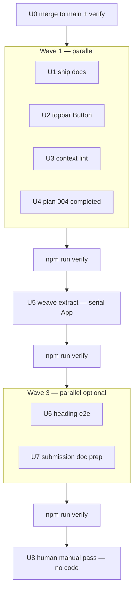
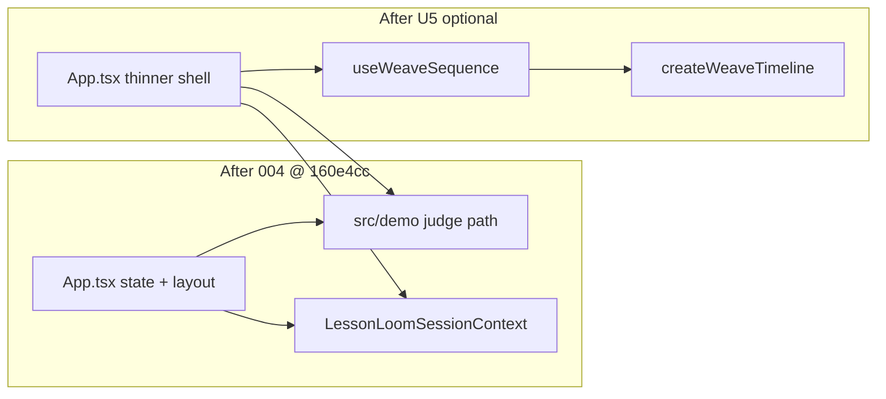

# feat: Remaining work — merge, docs, bounded App weave (subagent-driven)

## Summary

Land **all automatable remaining Lesson Loom work** after plan `2026-05-30-004` (commit `160e4cc`): merge the refactor branch, sync ship docs to current architecture, close small hygiene gaps, optionally extract weave GSAP orchestration from `App.tsx`, and prepare the human submission checklist—using **subagent-driven development** with **parallel implementers only on file-disjoint units**.

Human-only items (walkthrough video, Safari spot-check, Contra rules re-read) are explicit units with no code dispatch.

---

## Problem Frame

Plan 004 shipped judge-demo extraction, narrow session context, primitives archive, Button migration in sections, and milestone-based judge e2e—**verify 56/56** on `refactor/deferred-architecture`. That branch is pushed but not merged to `main`. `docs/APPLICATION_COMPLETE.md` still describes pre-refactor architecture (~713-line `App.tsx`, 53 e2e). Manual QA (`docs/qa/MANUAL_PASS_2026-05-30.md`) and many `ACCEPTANCE_STATUS.md` visual rows remain unchecked. Thermo Q2 is **partially resolved** (~567-line `App.tsx`); full shell split remains optional bounded work.

---

## Requirements

- R1. `npm run verify` green after every wave and at plan completion.
- R2. Judge-path behavior unchanged (weave gating, demo URL, presenter demo, export gates, four weave CTAs, pre-weave zip download, tab roving).
- R3. `refactor/deferred-architecture` integrated into `main` (merge or PR merge) with CI passing.
- R4. `docs/APPLICATION_COMPLETE.md` and plan `2026-05-30-004` reflect post-`160e4cc` reality (demo module, session context, e2e count).
- R5. `docs/THERMO_AUDIT_RESOLUTION.md` records merge baseline; Q2 documents weave-extract outcome if U5 runs.
- R6. Subagent workflow: no parallel implementers on the same file; spec review then code quality review per unit; orchestrator runs verify per wave.
- R7. Human submission artifacts: `MANUAL_PASS` and `docs/submission/README.md` updated with clear “human executes” instructions—not fake checkmarks.
- R8. No new prohibited claims; hero “AI-native” eyebrow unchanged unless copy-deck + e2e intentionally updated (out of scope).

---

## Scope Boundaries

### In scope

- Merge / PR for `refactor/deferred-architecture` → `main`
- Documentation parity (APPLICATION_COMPLETE, ACCEPTANCE cross-refs, plan 004 `status: completed`)
- `JudgeDemoTopbar` → `Button` (Q8 completion for topbar)
- ESLint `react-refresh/only-export-components` on session context (split hook or documented exception)
- **Bounded** weave orchestration extract from `App.tsx` (~80–120 lines: timeline ref, `runWeaveSequence`, kill/cleanup, weave live message callbacks)
- Optional: one Playwright spec for semantic heading order if it can assert without brittle selectors
- Submission prep docs (video URL placeholder, deploy smoke note)

### Deferred for later (unchanged product / Thermo acceptances)

- Full `App.tsx` decomposition (intersection nav, all state hooks, URL sync in one module)
- Q6: reduce weave entry points
- Gating zip download on `hasWoven`
- Hero “AI-native” eyebrow change
- Backend, auth, LMS, multi-lesson SaaS
- Thermo `/thermos` full re-audit (run in fresh session after merge + verify; not a subagent unit here)

### Outside this product's identity

- Real Stitch API, student data, autonomous grading

### Deferred to Follow-Up Work

- Extract intersection observer / `activeNav` into `useSectionSpy` (only if U5 leaves `App.tsx` still >500 lines)
- Self-hosted fonts for offline demo
- Presenter chrome without `demoRunning` for manual recording

---

## Execution model (subagent-driven development)

Follow the **subagent-driven-development** skill. Orchestrator rules:

| Step | Action |
|------|--------|
| Per unit | Dispatch **implementer** with full unit block (do not make subagents read this plan file) |
| After implementer | **Spec-compliance** subagent → fix loop until pass |
| After spec | **Code-quality** subagent → fix loop until pass |
| After wave | Orchestrator `npm run verify` |
| Commits | Orchestrator commits per unit or per wave (user may request push after green) |

### Parallel dispatch rules

| Rule | Detail |
|------|--------|
| **Parallel OK** | Units in one wave with **zero overlap** in `Files:` Create/Modify/Test paths |
| **Serial required** | Any unit modifying `src/App.tsx` |
| **Human-only** | U8 — orchestrator updates checklist template only; human performs browser QA |
| **Never** | Two implementers editing `App.tsx` concurrently |

### Wave diagram

---

## Key Technical Decisions

- KTD1. **Merge before parallel code waves:** Wave 1 assumes `main` includes `160e4cc` so docs and hygiene target the integration branch everyone will ship from.
- KTD2. **Weave extract boundary:** Move `weaveTimelineRef`, `createWeaveTimeline` wiring, `runWeaveSequence`, weave-step callbacks, and timeline kill into `src/motion/useWeaveSequence.ts` (or `src/hooks/useWeaveSequence.ts`). `App.tsx` keeps `hasWoven`, `activeWeaveStep`, `setWeaveLiveMessage` state; hook returns `{ runWeaveSequence, cancelWeave }`.
- KTD3. **Judge demo API unchanged:** `useLessonLoomDemo` continues to receive `runWeaveSequence` from App—signature stable for `judgeDemoSequence.ts`.
- KTD4. **Context lint fix:** Prefer splitting `useLessonLoomSession` into `LessonLoomSessionContext.tsx` (provider + context) and `useLessonLoomSession.ts` (hook) over blanket eslint-disable.
- KTD5. **Manual QA honesty:** U8 does not auto-check MANUAL_PASS boxes; it adds dated instructions and links video URL field for human entry.
- KTD6. **Zip + weave CTAs:** No product changes; e2e contracts preserved.

---

## High-Level Technical Design

Post-U5 target: `App.tsx` under ~480 lines; weave timing remains in `src/motion/createWeaveTimeline.ts` and `weaveTiming.ts`.

---

## Implementation Units

### U0. Merge refactor branch to main

**Goal:** Integrate `refactor/deferred-architecture` @ `160e4cc` into `main` with green CI.

**Requirements:** R3, R1

**Dependencies:** None (orchestrator-first)

**Files:**

- Git: `main`, `refactor/deferred-architecture`
- Verify: `package.json` scripts unchanged

**Approach:**

- Open PR `refactor/deferred-architecture` → `main` (or fast-forward merge if policy allows).
- Run `npm run verify` on merged result locally before push.
- Do not dispatch implementer subagents for git operations—orchestrator only.

**Execution note:** Orchestrator-only; no implementer subagent.

**Test scenarios:**

- Happy path: `npm run verify` exit 0 on merged `main`.
- Error path: resolve merge conflicts in favor of 004 behavior; re-run verify.

**Verification:** `main` contains `160e4cc` (or merge commit); remote CI green.

---

### U1. Sync APPLICATION_COMPLETE and README verify counts

**Goal:** Ship docs match code after 004.

**Requirements:** R4, R1

**Dependencies:** U0

**Files:**

- Modify: `docs/APPLICATION_COMPLETE.md`
- Modify: `README.md` (verify / e2e count only if mismatched)

**Approach:**

- Architecture table: `src/demo/`, `src/context/LessonLoomSessionContext.tsx`, `App.tsx` ~567 lines.
- Commands table: e2e **56/56** (excludes capture).
- Remove stale “primitives not imported” risk if archived path documented.
- Sign-off commit hash: post-merge SHA.

**Patterns to follow:** `docs/THERMO_AUDIT_RESOLUTION.md` post-polish table tone.

**Test scenarios:**

- Test expectation: none — documentation only.

**Verification:** No references to ~713-line monolithic `App.tsx` as current; e2e count matches `package.json` / CI.

**Subagent dispatch:** Implementer (fast) → spec → quality.

---

### U2. Migrate JudgeDemoTopbar to Button

**Goal:** Complete Q8 naming cleanup for demo topbar.

**Requirements:** R2, R1

**Dependencies:** U0

**Files:**

- Modify: `src/demo/JudgeDemoTopbar.tsx`

**Approach:**

- Replace `IndustrialButton` import with `Button` from `src/components/ui/Button.tsx`.
- Preserve all `data-testid`, `aria-*`, and judge-demo / presenter behaviors.

**Patterns to follow:** Section components already on `Button` (plan 004 U2).

**Test scenarios:**

- Happy path: `e2e/judge-demo.spec.ts` — Run judge demo completes.
- Happy path: `e2e/presenter-mode.spec.ts` — presenter chrome and captions.
- Happy path: `e2e/judge-scenes.spec.ts` — Scenes menu still works.

**Verification:** `rg IndustrialButton src/demo` empty; targeted e2e pass.

**Subagent dispatch:** Implementer (fast) → spec → quality. **Parallel with U1, U3, U4.**

---

### U3. Fix react-refresh lint on session context

**Goal:** `npm run lint` with zero warnings on context module.

**Requirements:** R1

**Dependencies:** U0

**Files:**

- Modify: `src/context/LessonLoomSessionContext.tsx`
- Create (optional): `src/context/useLessonLoomSession.ts`
- Modify: imports in `src/components/sections/ExportPackSection.tsx`, `StudentFractionGarden.tsx`, `TeachingSignal.tsx` if hook path changes

**Approach:**

- Split hook export to separate file so provider file only exports components (preferred per KTD4).
- Re-export hook from barrel if useful: `src/context/index.ts` (optional).

**Test scenarios:**

- Happy path: `npm run lint` — no `react-refresh/only-export-components` on context.
- Happy path: `e2e/smoke.spec.ts` — export gating still works via context.

**Verification:** Lint clean; smoke export path green.

**Subagent dispatch:** Implementer (fast) → spec → quality. **Parallel with U1, U2, U4.**

---

### U4. Close plan 004 and cross-link acceptance docs

**Goal:** Planning artifacts reflect shipped 004 work.

**Requirements:** R4, R7

**Dependencies:** U0

**Files:**

- Modify: `docs/plans/2026-05-30-004-refactor-deferred-architecture-plan.md` (frontmatter `status: completed` only)
- Modify: `docs/qa/ACCEPTANCE_STATUS.md` (add note under automated rows: architecture refactor @ merge SHA)
- Modify: `docs/THERMO_AUDIT_RESOLUTION.md` (merge baseline date + commit)

**Approach:**

- Flip 004 `status: active` → `completed` per shipping workflow—no body checkbox edits.
- ACCEPTANCE: add one-line “Code architecture” note pointing to APPLICATION_COMPLETE; do not fake-check manual visual rows.

**Test scenarios:**

- Test expectation: none — documentation only.

**Verification:** Plan 004 frontmatter `status: completed`; THERMO references `src/demo/` and context as merged.

**Subagent dispatch:** Implementer (fast) → spec → quality. **Parallel with U1, U2, U3.**

---

### U5. Extract weave sequence hook from App.tsx

**Goal:** Bounded Q2 continuation—move GSAP weave orchestration out of `App.tsx` without changing UX.

**Requirements:** R1, R2, R5

**Dependencies:** U1–U4 complete; Wave 1 verify green

**Files:**

- Create: `src/motion/useWeaveSequence.ts` (or `src/hooks/useWeaveSequence.ts`)
- Modify: `src/App.tsx`
- Modify: `src/motion/index.ts` (re-export if pattern exists)
- Test: `e2e/smoke.spec.ts`, `e2e/reduced-motion.spec.ts`, `e2e/weave-entry-points.spec.ts`

**Approach:**

- Hook accepts: `prefersReducedMotion`, state setters (`setHasWoven`, `setActiveWeaveStep`, `setWeaveLiveMessage`), `weaveSteps.length`.
- Hook owns: `weaveTimelineRef`, `createWeaveTimeline` call, kill on unmount, `runWeaveSequence` callback.
- `App.tsx` passes `runWeaveSequence` to sections and `useLessonLoomDemo` unchanged.
- **Do not** move intersection nav, URL state, or judge demo in this unit.

**Execution note:** Characterization-first—run weave e2e before and after; no increase in judge-demo timeouts.

**Patterns to follow:** `src/motion/createWeaveTimeline.ts`, `src/motion/README.md`, existing `useScrollToSection.ts` hook style.

**Test scenarios:**

- Happy path: `e2e/smoke.spec.ts` — hero weave → banner → student unlock.
- Happy path: `e2e/weave-entry-points.spec.ts` — panel + intake weave CTAs.
- Happy path: `e2e/reduced-motion.spec.ts` — immediate banner without long GSAP wait.
- Happy path: `e2e/judge-demo.spec.ts` — demo still calls weave via `runWeaveSequence`.
- Edge case: unmount during weave — no console errors (manual or unit smoke if added).

**Verification:** `App.tsx` line count reduced by ≥60 vs post-U0 baseline; `npm run verify` green.

**Subagent dispatch:** Implementer (capable) → spec → quality. **Serial—only App.tsx editor in this wave.**

---

### U6. Optional Playwright heading-order smoke

**Goal:** Automate one manual ACCEPTANCE row if stable.

**Requirements:** R1, R7

**Dependencies:** U5 verify green (or skip unit if U5 deferred)

**Files:**

- Create or modify: `e2e/semantic-headings.spec.ts`
- Modify: `docs/qa/ACCEPTANCE_STATUS.md` (link row to spec if added)

**Approach:**

- Assert single `h1` on load; after weave, each major `section` has one `h2` (use existing `section` / `aria-labelledby` patterns—read DOM before writing selectors).
- Skip if headings are inconsistent—document skip in ACCEPTANCE rather than flaky spec.

**Test scenarios:**

- Happy path: one `h1`, expected `h2` count for woven page sections.
- Error path: spec skipped with comment in ACCEPTANCE if DOM does not support stable assertions.

**Verification:** New spec passes in `npm run test:e2e` or explicit “deferred” note in ACCEPTANCE.

**Subagent dispatch:** Implementer (fast) → spec → quality. **Parallel with U7.**

---

### U7. Submission doc prep (automated portions)

**Goal:** Make human submission steps impossible to miss.

**Requirements:** R7

**Dependencies:** U0

**Files:**

- Modify: `docs/submission/README.md`
- Modify: `docs/qa/MANUAL_PASS_2026-05-30.md`
- Modify: `docs/submission/WALKTHROUGH.md` (only if arc outdated)

**Approach:**

- README: “After merge @ `<SHA>`” verify command; link to GitHub Pages workflow.
- MANUAL_PASS: add **Instructions** section—human checks boxes; link RECORDING.md; empty video URL field.
- Do not invent video URL or mark Safari as passed.

**Test scenarios:**

- Test expectation: none — documentation only.

**Verification:** MANUAL_PASS clearly labeled human-executed; README manual steps unchanged in intent.

**Subagent dispatch:** Implementer (fast) → spec → quality. **Parallel with U6.**

---

### U8. Human manual QA and submission closure

**Goal:** Close R7 manual gaps for Contra/Stitch submit.

**Requirements:** R7, R8

**Dependencies:** U0–U7; live deploy URL confirmed

**Files:**

- Modify: `docs/qa/MANUAL_PASS_2026-05-30.md` (human fills checkboxes + video URL)
- Modify: `docs/qa/ACCEPTANCE_STATUS.md` (mirror checked manual rows with `_manual pass 2026-05-30_` and tester name)
- Modify: `docs/submission/README.md` (video URL when available)

**Approach:**

- **Execution note: Human-only.** Orchestrator or founder runs browser QA per MANUAL_PASS; records Safari N/A if unavailable.
- Agent may assist by pasting user-provided video URL into docs after human confirms.

**Test scenarios:**

- Happy path: MANUAL_PASS ≥90% checked; video URL non-empty.
- Happy path: ACCEPTANCE manual rows updated to match.

**Verification:** Phase 3 plan R8 satisfied or N/A with reason on each unchecked row.

**Subagent dispatch:** None for implementer. Orchestrator coordinates with human.

---

## Orchestrator checklist

| Step | Action |
|------|--------|
| 1 | Confirm on `main` post-merge (U0) |
| 2 | `npm run verify` baseline |
| 3 | TodoWrite U0–U8 |
| 4 | U0 merge + verify |
| 5 | **Wave 1:** dispatch U1, U2, U3, U4 implementers **in parallel** (4 subagents) |
| 6 | Spec + quality review each; orchestrator commit(s); `npm run verify` |
| 7 | **Wave 2:** U5 implementer → reviews → commit → verify |
| 8 | **Wave 3:** U6 + U7 parallel (optional U6 if timeboxed) → verify |
| 9 | Human U8 |
| 10 | Optional: `/thermos` in fresh session on final `main` SHA |
| 11 | Flip this plan `status: completed` when U0–U7 done and U8 human-complete |

---

## Risks and mitigations

| Risk | Mitigation |
|------|------------|
| Merge conflicts with stale `main` | Resolve on `main` checkout; re-run full verify |
| U5 breaks weave timing | Characterization e2e; no timeout inflation |
| Parallel collision on docs | U1 vs U4 both touch docs—**split**: U1 APPLICATION_COMPLETE+README; U4 plans+THERMO+ACCEPTANCE note only |
| Fake manual QA | U8 human-only; agents do not check MANUAL_PASS boxes |
| Scope creep into hero copy | KTD6; copy-deck e2e guards |

**Note:** U1 and U4 both touch `ACCEPTANCE_STATUS.md`—orchestrator should either merge U1/U4 into one doc unit or run U4 after U1 serially. **Revised parallel batch:** U1 (APPLICATION_COMPLETE + README), U2, U3 parallel; **U4 serial after U1** (shared ACCEPTANCE file).

### Revised Wave 1 parallel groups

| Group | Units | Parallel? |
|-------|-------|-----------|
| A | U1, U2, U3 | Yes — disjoint files |
| B | U4 | After U1 — touches ACCEPTANCE + plans |

---

## Acceptance (plan-level)

- [ ] R1: `npm run verify` green on final `main`
- [ ] R3: 004 merged to `main`
- [ ] R4: APPLICATION_COMPLETE + plan 004 accurate
- [ ] R5: THERMO Q2 notes weave hook if U5 shipped
- [ ] R6: Subagent review per automated unit
- [ ] R7: MANUAL_PASS ready for human; video URL filled when submit-ready
- [ ] R8: No prohibited claims introduced

---

## Sources and research

| Source | Use |
|--------|-----|
| `docs/plans/2026-05-30-004-refactor-deferred-architecture-plan.md` | Completed scope; wave model |
| `docs/THERMO_AUDIT_RESOLUTION.md` | Q2 partial, Q6/Q12 resolved, deferrals |
| `docs/APPLICATION_COMPLETE.md` | Drift to fix (U1) |
| `docs/plans/2026-05-30-002-feat-judge-wow-phase-3-plan.md` | U10 submission closure pattern |
| `docs/qa/ACCEPTANCE_STATUS.md`, `docs/qa/MANUAL_PASS_2026-05-30.md` | Manual gaps |
| `AGENTS.md` | Judge path, verify gate, no scope creep |
| `src/App.tsx`, `src/motion/createWeaveTimeline.ts` | U5 extract boundary |
