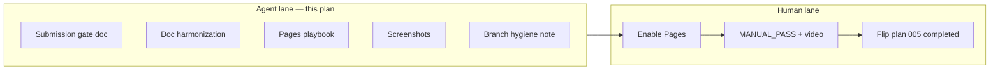

# feat: Agent-side submission readiness (post–plan 005)

## Summary

Close **every remaining task an agent can complete** to hand off Lesson Loom for Contra/Stitch submission: harmonize ship docs on `main`, publish a clear agent-vs-human gate, run screenshot capture locally, document GitHub Pages enablement, and leave human MANUAL_PASS/video work explicit—without fake QA checkmarks or product scope changes.

---

## Problem Frame

Plans 004–005 landed on `main` (`4a9ba91`): verify **58/58** e2e + smoke green in CI. Automated architecture and doc hygiene are done. Submission is blocked by **human** steps (MANUAL_PASS, walkthrough video, Safari spot-check, enabling GitHub Pages in repo Settings) and by **ops** steps agents can partially automate (screenshot generation, deploy playbook, final doc parity).

Plan `2026-05-30-005` stays **`status: active`** until human U8 completes (per `AGENTS.md`).

---

## Requirements

- R1. `npm run verify` green after every wave and at completion.
- R2. No change to judge-path product behavior, weave CTAs, export gates, or copy-deck strings.
- R3. Agents **must not** check `MANUAL_PASS` or `ACCEPTANCE_STATUS` manual rows as passed without human attestation.
- R4. Ship docs (`APPLICATION_COMPLETE`, `README`, `THERMO_AUDIT_RESOLUTION`, `docs/submission/`) reflect `main` @ final SHA and **58/58** e2e.
- R5. A single **submission readiness** doc lists agent-complete vs human-required items with links.
- R6. Screenshot capture run documented; output paths match `docs/submission/README.md` (binaries remain gitignored unless user opts in).
- R7. GitHub Pages enablement steps documented; workflow unchanged unless a concrete fix is identified (current failure: Pages not enabled → deploy 404).
- R8. Plan 005 **not** flipped to `completed` in this plan (human U8 gate).

---

## Scope Boundaries

### In scope (agent)

- Documentation parity and submission gate artifact
- Local `npm run capture:screenshots` + README artifact list
- Pages deploy playbook (Settings + re-run workflow + live smoke checklist for human)
- Optional repo hygiene note (merged branches safe to delete)
- `npm run verify` on `main`

### In scope (human only — document, do not execute)

- Enable GitHub Pages (Settings → GitHub Actions)
- Complete `docs/qa/MANUAL_PASS_2026-05-30.md`
- Record walkthrough video; paste URL
- Safari / Mobile Safari spot-check
- Re-read official Stitch/Contra rules
- Flip plan 005 to `completed` after U8

### Deferred for later

- `/thermos` re-audit (fresh session after human confirms live deploy)
- Full `App.tsx` split, Q6 weave CTAs, zip gate, hero copy
- Committing screenshot binaries to git
- Auto-checking manual QA in CI

### Outside product identity

- Backend, auth, LMS, multi-lesson SaaS

---

## Execution model

Use **subagent-driven development** for implementer units; orchestrator runs verify per wave.

| Wave | Units | Parallel? |
|------|-------|-----------|
| 1 | U1 submission gate doc | Solo (creates anchor doc) |
| 2 | U2 doc harmonization, U3 Pages playbook | Parallel if U3 only touches `docs/submission/` deploy section; **serial** if both edit `docs/submission/README.md` → run **U2 then U3** |
| 3 | U4 screenshot capture | Solo (long-running) |
| 4 | U5 branch hygiene note | Solo |

**Recommended sequencing:** U1 → (U2 → U3) → U4 → U5 → verify.

---

## Key Technical Decisions

- KTD1. **No fake manual QA:** Agents update instructions and links only; humans check boxes and sign MANUAL_PASS.
- KTD2. **Pages 404 is expected until Settings:** Do not “fix” workflow without evidence; document enablement path from failed deploy log.
- KTD3. **Screenshots local-only:** Run capture; document paths; do not commit `submission-screenshots/` unless user explicitly requests.
- KTD4. **Plan 005 completion is human-gated:** This plan completes when agent lane is done; plan 005 flips later.
- KTD5. **No new e2e against production URL** unless optional skipped spec with env guard—default is documented manual live smoke only (avoids flaky CI).

---

## High-Level Technical Design

---

## Implementation Units

### U1. Create submission readiness gate document

**Goal:** One page that states what is done, what agents finished, and what only a human can do.

**Requirements:** R3, R5

**Dependencies:** None

**Files:**

- Create: `docs/submission/SUBMISSION_READINESS.md`

**Approach:**

- Sections: **Agent complete** (verify green, architecture on `main`, automated e2e coverage summary), **Human required** (Pages enable, MANUAL_PASS, video, Safari, rules), **Commands** (`npm run verify`, `capture:screenshots`), **Live URL checklist** (judge demo on Pages after deploy).
- Link to `MANUAL_PASS`, `README`, `WALKTHROUGH.md`, `APPLICATION_COMPLETE.md`.
- Explicit: do not check manual boxes in git.

**Test scenarios:** Test expectation: none — documentation.

**Verification:** File exists; links resolve; no manual checkboxes marked `[x]` by agent.

---

### U2. Harmonize ship and audit docs on `main`

**Goal:** Eliminate drift (SHAs, e2e counts, architecture pointers).

**Requirements:** R4, R1

**Dependencies:** U1 (optional cross-links)

**Files:**

- Modify: `docs/APPLICATION_COMPLETE.md`
- Modify: `README.md` (verify section only if needed)
- Modify: `docs/THERMO_AUDIT_RESOLUTION.md` (post-merge baseline @ working SHA)

**Approach:**

- Sign-off references final commit after this plan’s commits.
- Architecture: `src/demo/`, `src/context/`, `src/motion/useWeaveSequence.ts`, `App.tsx` ~545 lines.
- E2e: **58/58** (includes `semantic-headings`).
- THERMO: note Q2 partial with weave hook; merge baseline date.

**Patterns to follow:** Existing APPLICATION_COMPLETE table style.

**Test scenarios:** Test expectation: none — documentation.

**Verification:** No stale “53 e2e” or “713-line App.tsx” references in these three files.

---

### U3. GitHub Pages deploy playbook

**Goal:** Human can enable Pages and get a green deploy without guessing.

**Requirements:** R7

**Dependencies:** U2 (avoid README conflict — edit different sections or run after U2)

**Files:**

- Modify: `docs/submission/README.md` (expand **One-time: enable GitHub Pages**)
- Modify: `docs/submission/SUBMISSION_READINESS.md` (link playbook)

**Approach:**

- Document: Settings → Pages → Source **GitHub Actions**; re-run **Deploy GitHub Pages** workflow; expected URL pattern; live smoke steps (open URL, Run judge demo, shareable `?w=1#student`).
- Note: build job may succeed while deploy job 404s until Pages enabled (observed on `4a9ba91`).
- Do not change `.github/workflows/deploy-pages.yml` unless investigation finds a real bug (workflow already sets `VITE_BASE_PATH` and permissions).

**Test scenarios:** Test expectation: none — documentation.

**Verification:** Playbook matches workflow file; mentions 404-until-enabled.

---

### U4. Run screenshot capture and document artifacts

**Goal:** Generate local submission screenshots and confirm filenames.

**Requirements:** R6, R1

**Dependencies:** U2, U3

**Files:**

- Modify: `docs/submission/README.md` (artifact table + “last captured @ SHA” note)
- Modify: `docs/submission/SUBMISSION_READINESS.md`

**Approach:**

- Run: `npm run build`, `npx playwright install chromium` (if needed), `npm run capture:screenshots`.
- Confirm `submission-screenshots/01-hero.png` … `06-mobile-student.png` exist locally.
- Do not commit PNGs unless user requests.
- If capture fails, fix only e2e/spec issues in scope—no product changes.

**Execution note:** Run verify before capture if tree dirty.

**Test scenarios:**

- Happy path: six PNG files present after capture script.
- Error path: document failure + fix in spec if selector drift.

**Verification:** Capture command exit 0; README lists files; verify still green if specs touched.

---

### U5. Repo hygiene note (merged branches)

**Goal:** Reduce confusion about which branch to use post-merge.

**Requirements:** R5

**Dependencies:** U1

**Files:**

- Modify: `docs/submission/SUBMISSION_READINESS.md` (short **Branches** subsection)

**Approach:**

- State: **`main`** is integration branch @ `4a9ba91+`.
- List safe-to-delete after confirm: `refactor/deferred-architecture`, `fix/thermo-post-ship-polish` (merged).
- Do not delete remote branches without user approval; document only unless user asked to prune.

**Test scenarios:** Test expectation: none — documentation.

**Verification:** Branch guidance matches git history; no `git push` or branch deletion in this unit unless user explicitly requests.

---

## Orchestrator checklist

| Step | Action |
|------|--------|
| 1 | Checkout `main`, pull `origin/main` |
| 2 | `npm run verify` baseline |
| 3 | U1 → U2 → U3 → U4 → U5 (subagent per unit optional) |
| 4 | `npm run verify` final |
| 5 | Commit on `main` (user must ask to push) |
| 6 | Leave plan 005 `active`; flip **this** plan to `completed` when U1–U5 done |
| 7 | Tell human: enable Pages → MANUAL_PASS → video → flip plan 005 |

---

## Risks and mitigations

| Risk | Mitigation |
|------|------------|
| Agent checks manual QA boxes | KTD1; verification on U1 |
| Screenshot flake | Fix capture spec only; no UX changes |
| Scope creep | No App refactor; no copy-deck changes |
| Pages still 404 after doc | Human must enable Settings; playbook states this |

---

## Acceptance (plan-level)

- [x] R1: verify green on final `main`
- [x] R4: ship docs aligned with 58/58 and current architecture
- [x] R5: `SUBMISSION_READINESS.md` published
- [x] R6: capture run documented (PNGs local)
- [x] R7: Pages playbook complete
- [x] R3: no fake manual checkmarks in repo
- [x] R8: plan 005 still `active` until human U8

---

## Sources

| Source | Use |
|--------|-----|
| `docs/plans/2026-05-30-005-feat-remaining-work-subagent-plan.md` | U8 human gate |
| `docs/submission/README.md` | Manual steps, capture paths |
| `docs/qa/MANUAL_PASS_2026-05-30.md` | Human checklist |
| `AGENTS.md` | Learned preferences, no fake QA |
| `.github/workflows/deploy-pages.yml` | Pages deploy contract |
| `docs/APPLICATION_COMPLETE.md` | Sign-off template |
