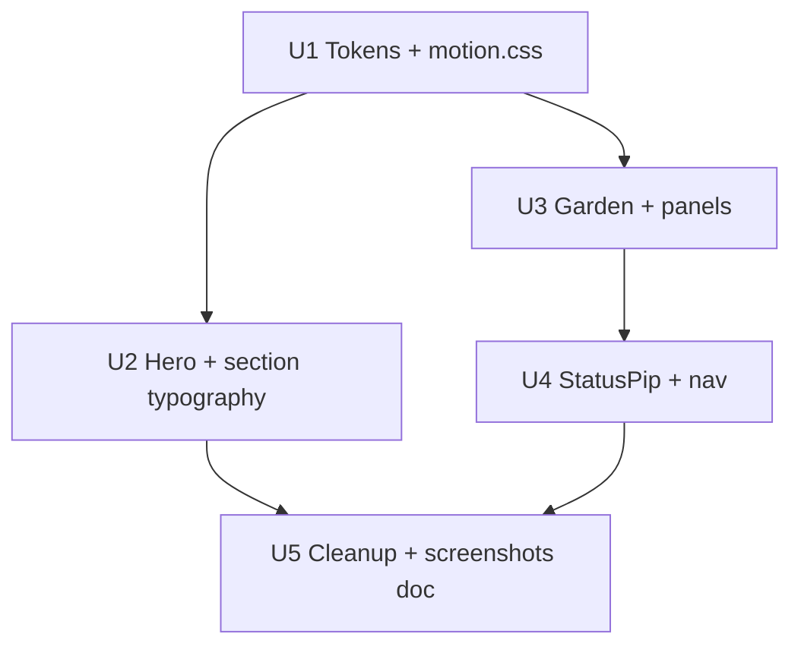

# feat: Frontend design polish (post–submission readiness)

## Summary

Align Lesson Loom’s visible UI with the **calm premium classroom studio** thesis in `03_DESIGN.md`: fix token drift (`--ll-orange` orphans), sharpen hero and Fraction Garden perception, unify panel/motion chrome, and clean StatusPip/nav affordances — without copy-deck churn, weave testid changes, or product scope expansion. Execute via **subagent-driven development** (implementer → spec review → quality review per unit); orchestrator runs `npm run verify` after each wave.

---

## Problem Frame

`main` is verify-green (58/58 e2e, smoke 3/3). Submission ops (plan 006) harmonized docs; human MANUAL_PASS and video remain. Judges still score **first-impression perception** (“not generic SaaS”, garden hero, restrained motion) per `docs/qa/ACCEPTANCE_STATUS.md` and Phase 3 design spec.

Research found **design-system drift**: `src/styles/motion.css` and `ResponsivePreview.tsx` reference `--ll-orange` / `--ll-orange-glow`, which are absent from `src/styles/tokens.css` (only archived `primitives.css` and export stub text). StatusPip `orange`/`cyan` tones are remapped in CSS but still used in TSX. Hero `scanline` markup is inert (CSS sets `display: none`). Panel bracket/screw chrome and nav gradient read heavier than `03_DESIGN.md` “paper studio” intent.

---

## Requirements

- R1. `npm run verify` green after every implementation unit and at plan completion.
- R2. Palette and motion accents use tokens defined in `tokens.css` (sage, lavender, gold, navy) — no undefined `--ll-orange*` in `src/styles/` or `src/components/`.
- R3. Weave active path and `#student.ll-section--woven-active` ring remain visually legible and pass `e2e/reduced-motion.spec.ts`.
- R4. Hero trust line and section eyebrow meet WCAG AA contrast (≥4.5:1) at 1440px and 430px; no change to hero headline or CTA strings in `17_COPY_DECK.md`.
- R5. Fraction tile selected state and garden bed preview update are obvious without color-only signaling; success state uses gold accent per `16_INTERACTION_AND_MOTION_SPEC.md`.
- R6. No regression to weave testids (`weave-lesson-hero`, `weave-lesson-panel`, `weave-lesson-intake`), export copy gating, or zip download behavior.
- R7. `capture:screenshots` run documented after U5; binaries stay gitignored unless user opts in.
- R8. Agents do not check MANUAL_PASS boxes or flip plan 005 to completed.

---

## Key Technical Decisions

- **KTD1 — Orange retirement, not reintroduction:** Replace `--ll-orange` / `--ll-orange-glow` usages with `--ll-sage-deep`, `--ll-sage-glow`, and/or `--ll-lavender-deep` rather than adding orange back to `tokens.css`. Rationale: AGENTS.md and Thermo history explicitly reject industrial orange as primary UI.
- **KTD2 — StatusPip migration strategy:** Add canonical tones at call sites (`sage`, `lavender`, `gold`) and keep `orange`/`cyan` as deprecated aliases in `StatusPip.tsx` mapping to the same CSS for one release — avoids a breaking sweep while cleaning new code. Rationale: many files reference legacy tone names; e2e does not assert tone class names.
- **KTD3 — Panel chrome reduction, not removal:** Keep bracket corners on hero and student primary panels; remove `screws` from secondary panels (UDL, Made with Stitch, duplicate previews). Rationale: preserves “crafted studio” without industrial hardware noise everywhere.
- **KTD4 — Scanline removal:** Delete `scanline` / `scanline--active` markup from `HeroLanding.tsx` and related CSS rules (already no-ops). Do not add CRT-style effects. Rationale: conflicts with calm thesis; `WeaveSignalLine` already carries weave metaphor.
- **KTD5 — Nav icons deferred to optional U4:** Prefer CSS-only nav polish (flat paper background) in U4; SVG icon replacement only if timeboxed and does not block verify. Rationale: unicode icons work for demo; icon asset scope is easy to overrun.
- **KTD6 — Subagent execution:** One implementer subagent per U-ID; orchestrator never parallelizes implementers on the same branch. Spec compliance review before code quality review per `subagent-driven-development` skill.

---

## High-Level Technical Design

### Polish layers (dependency order)



### Visual contract (unchanged product spine)

```text
trusted lesson plan → weave → teaching signal → live student/teacher/UDL
→ review → export pack → Made with Stitch
```

---

## Scope Boundaries

### In scope

- `src/styles/tokens.css`, `motion.css`, `components-shared.css`, `components-sections.css`, `layout.css`
- Section components: `HeroLanding`, `StudentFractionGarden`, `LessonWeave`, `ResponsivePreview`, `MadeWithStitch`, `DifferentiationUDL`
- `StatusPip.tsx`, `App.tsx` nav surface styles only
- `index.html` only if `theme-color` or meta needs sync (already `#112035`)

### Deferred for later

- Hero eyebrow / “AI-native” copy changes
- Full `App.tsx` decomposition
- Weave CTA testid consolidation (Q6)
- Zip download gated on weave
- `/thermos` re-audit (human-triggered post-deploy)
- Committing screenshot PNGs to git

### Outside product identity

- Backend, auth, LMS, multi-lesson SaaS, real AI

---

## Execution model

| Wave | Units | Parallel implementers? |
|------|-------|----------------------|
| 1 | U1 | Solo |
| 2 | U2, U3 | Serial preferred (both touch hero/garden CSS); orchestrator may run U2 then U3 |
| 3 | U4 | Solo |
| 4 | U5 | Solo |

After each unit: implementer runs targeted checks; orchestrator runs `npm run verify` at end of waves 2 and 4.

---

## Implementation Units

### U1. Token and motion alignment

**Goal:** Eliminate undefined CSS variables; weave/student activation uses authoritative palette.

**Requirements:** R1, R2, R3

**Dependencies:** None

**Files:**
- `src/styles/tokens.css` (only if new semantic aliases needed, e.g. `--ll-weave-active`)
- `src/styles/motion.css`
- `src/components/sections/ResponsivePreview.tsx`
- `src/data/lessonLoomData.ts` (export stub CSS string only — remove orange comment tokens)

**Approach:** Replace `--ll-orange` stroke/glow/box-shadow with sage/lavender tokens. Add `--ll-weave-active` and `--ll-weave-glow` aliases in `tokens.css` if it improves readability. Ensure `prefers-reduced-motion` block unchanged in behavior.

**Patterns to follow:** `components-shared.css` StatusPip remapping; `16_INTERACTION_AND_MOTION_SPEC.md` timing unchanged.

**Test scenarios:**
- Covers reduced-motion contract: after `weaveFromHero()`, `#student` has `ll-section--woven-active` within 1s when reduced motion preferred.
- Weave path SVG `.weave-path__line--active` renders with non-zero stroke (computed style uses defined custom property).
- Responsive preview device chips use defined border/fill tokens (no invalid var in computed styles).

**Verification:** `npm run test:e2e -- e2e/reduced-motion.spec.ts`; `npm run verify` at wave end.

---

### U2. Hero and trust-line perception

**Goal:** First viewport reads “premium studio” in 30s; trust copy passes contrast.

**Requirements:** R1, R4, R6

**Dependencies:** U1

**Files:**
- `src/components/sections/HeroLanding.tsx`
- `src/styles/components-sections.css` (hero block)
- `src/styles/base.css` (only if `.ll-section__eyebrow` contrast tweak is global)

**Approach:** Remove scanline classes per KTD4. Move inline hero layout styles to CSS utilities. Increase eyebrow contrast (muted → graphite or sage-deep). Improve CTA row stacking at ≤430px. Keep `weave-lesson-hero` testid and all copy-deck strings.

**Test scenarios:**
- Hero title and primary CTA visible at 430px width (`e2e/viewports.spec.ts` pattern).
- Trust line text still contains “Teacher-reviewed draft” (`e2e/copy-deck.spec.ts`).
- No horizontal document scroll at 1440 and 430 (`e2e/viewports.spec.ts`).

**Verification:** `npm run test:e2e -- e2e/copy-deck.spec.ts e2e/viewports.spec.ts e2e/responsive.spec.ts`

---

### U3. Fraction garden and panel tactility

**Goal:** Tile selection and success moment feel tactile and garden-themed.

**Requirements:** R1, R5, R6

**Dependencies:** U1

**Files:**
- `src/components/sections/StudentFractionGarden.tsx`
- `src/styles/components-shared.css` (garden-bed, fraction-tile, panel)
- `src/components/sections/LessonWeave.tsx` (panel screws/bracket only)
- `src/components/sections/DifferentiationUDL.tsx` (remove screws per KTD3)

**Approach:** Strengthen `.garden-bed--active` / selected tile border using sage/lavender; gold pulse on success aligned with `showSuccessPulse`. Unify panel shadow tokens on student hero panel. Reduce screw decoration on non-primary panels.

**Test scenarios:**
- Select three tiles, check answer — success copy visible (`e2e/smoke.spec.ts` golden path).
- Selected tile retains visible focus ring on keyboard activation (tab to tile, `focus-visible` styles present).
- Garden section remains in viewport after mobile nav jump (`e2e/responsive.spec.ts`).

**Verification:** `npm run test:e2e -- e2e/smoke.spec.ts e2e/responsive.spec.ts`

---

### U4. StatusPip tones and nav chrome

**Goal:** API and visuals align on sage/lavender/gold; side nav matches paper studio.

**Requirements:** R1, R2

**Dependencies:** U3

**Files:**
- `src/components/ui/StatusPip.tsx`
- `src/components/sections/HeroLanding.tsx`, `TeachingSignal.tsx`, `ReviewSafety.tsx`, `MadeWithStitch.tsx`, `LessonWeave.tsx`, `PrintableFallback.tsx`, `StudentFractionGarden.tsx`, `DifferentiationUDL.tsx`
- `src/styles/layout.css` (`.app-nav` gradient → flat paper)
- `src/App.tsx` (nav icons only if SVG path chosen)

**Approach:** Migrate `tone="cyan"` → `lavender`, `tone="orange"` → `sage` or `gold` by semantic meaning. Document deprecated aliases in `StatusPip`. Flatten nav background; ensure `aria-label` on nav links unchanged.

**Test scenarios:**
- Judge demo and scenes still reach export (`e2e/judge-demo.spec.ts` or `judge-scenes.spec.ts`).
- Side nav links remain keyboard operable; active state visible (manual spot-check documented in unit report).
- Presenter mode still hides `.app-nav` (`e2e/presenter-mode.spec.ts`).

**Verification:** `npm run test:e2e -- e2e/presenter-mode.spec.ts e2e/judge-scenes.spec.ts`

---

### U5. CSS cleanup, docs, and screenshot handoff

**Goal:** No dead CSS; submission artifacts refreshed; APPLICATION_COMPLETE notes polish.

**Requirements:** R1, R7

**Dependencies:** U2, U4

**Files:**
- `src/styles/components-sections.css` (remove scanline rules if not deleted in U2)
- `docs/APPLICATION_COMPLETE.md` (short “design polish 007” note)
- `docs/submission/README.md` (screenshot refresh instruction only)

**Approach:** Grep `src/` for `--ll-orange`, `scanline`, inline `style=` in hero. Run `npm run capture:screenshots`; record output paths in submission README. Do not commit PNGs.

**Test scenarios:**
- `npm run verify` exits 0.
- Grep for `--ll-orange` under `src/styles` and `src/components` returns zero (export data stub may keep historical string in zip payload — document if intentional).

**Verification:** Full `npm run verify`; optional `npm run capture:screenshots`.

---

## Risks and Mitigation

| Risk | Mitigation |
|------|------------|
| Weave ring too subtle after orange removal | User test at U1; keep 2px ring, use lavender-deep + soft glow token |
| Spec reviewer flags copy change | Spec review explicitly checks `e2e/copy-deck.spec.ts` strings |
| Parallel U2/U3 CSS merge conflicts | Serial U2 → U3 on same branch |
| Screenshot drift fails manual QA | Human re-runs MANUAL_PASS visual rows after capture |

---

## Sources and Research

- `03_DESIGN.md`, `16_INTERACTION_AND_MOTION_SPEC.md`, `17_COPY_DECK.md`
- `docs/superpowers/specs/2026-05-30-judge-wow-phase-3-design.md`
- `docs/THERMO_AUDIT_RESOLUTION.md`, `AGENTS.md` Learned facts
- Canvas audit: `canvases/lesson-loom-frontend-audit.canvas.tsx` (IDE-managed)
- Repo research: motion/token drift, e2e class coupling (`ll-section--woven-active`, `ll-surface-highlight`)

---

## Subagent dispatch notes

When executing with `subagent-driven-development`:

1. Orchestrator reads this plan once; passes **full unit text** to each implementer (do not point subagents at plan file).
2. Implementer prompt must include: AGENTS.md palette rule, “no copy-deck edits”, and exact test files from unit Verification.
3. **No commits** unless user requests; subagents stage changes only.
4. After all units: optional human `capture:screenshots` + MANUAL_PASS visual rows.
